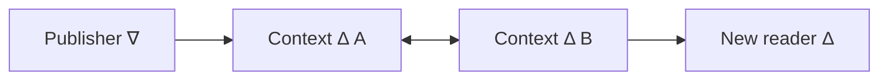
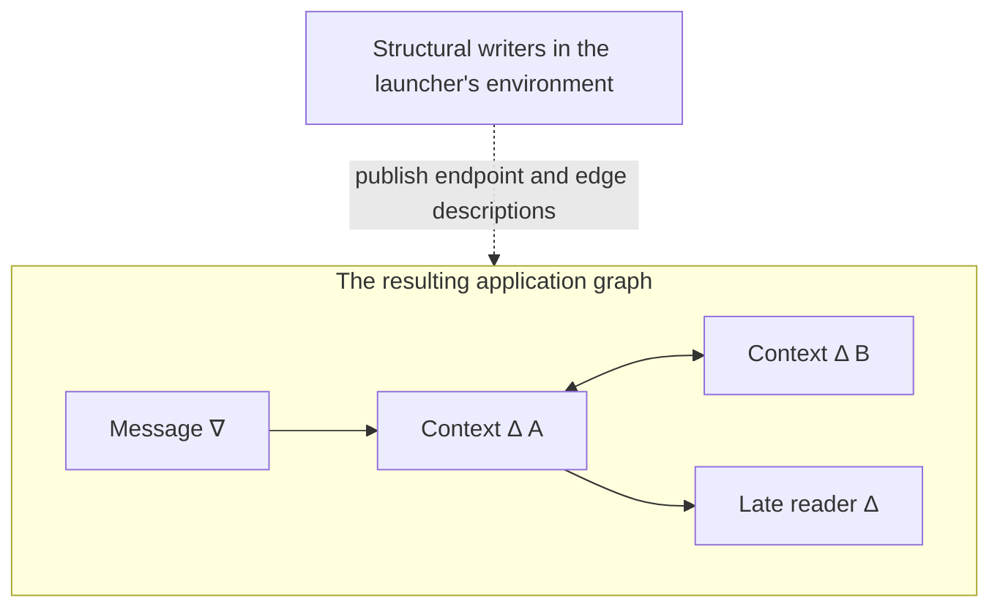

# ECLIPS

ECLIPS explores a way for distributed programs to cooperate through a shared,
typed data space. Programs publish descriptions of things and read the state
available to them. A graph describes where that information belongs, including
which existing data a newly connected reader should receive as its **context**.

This repository contains a Haskell implementation with real TCP networking,
multiple application processes, and a replicated Oracle for global coordination.
It is an experimental, in-memory prototype for small, friendly deployments.
Durable restart, production hardening, and stable public interfaces remain future
work. The [architecture guide](docs/architecture/README.md) explains the current
implementation, and the [verification guide](docs/verification/README.md) describes
the checks and their limits.

## Project status and authorship

This repository is published to support study, discussion, and experimentation. It is not intended as production middleware. It was built and documented entirely by GPT-5.6 Sol Ultra and GPT-6 Astra Ultra, elaborating my original [paper](docs/eclips-20100525.pdf) with but a small amount of guidance from me.

There are no commitments concerning maintenance, compatibility, or support.

The code is available under the [MIT License](LICENSE).

## The idea

An application writes through a **nabla** (∇), reads from a **delta** (Δ), and
connects these endpoints with directed edges. Each endpoint handles one **sort**:
a description of the values' shape, their object keys, and how competing updates
are ordered. Deltas retain the winning state of each object. Reading a delta does
not consume its data.

The graph also gives a new delta its context. Connecting it downstream of existing
deltas lets it obtain their retained state, even when the original publisher has
already gone away. This is the central idea in the introductory example:



The arrows are data-space edges. The two context deltas form a preserving cycle,
or strongly connected component (SCC). Their owning processes remain alive after
the publisher exits. A reader created later gets the greeting from this context;
it does not need the publisher to send it again.

Each application connects to one **Herald**, which hosts its delta stores and
handles the network work. Heralds send ordinary publications directly to the
Heralds holding the destination deltas. The **Oracle** coordinates decisions that
need a common order, such as process lifetimes and transfers of object ownership.
It is replicated with Raft across selected Herald hosts. Ordinary publications do
not pass through it.

The graph is itself represented as data. Applications use the same operations to
publish values and to create their endpoints and connections. **Labels** control
who may change controlled objects, including those graph objects. An
**environment** supplies the private structural endpoints from which an application
can build its own part of the data space.

## What the API feels like

Applications normally use `Eclips.Application.Typed`. A connection descriptor identifies a
prepared logical process and its Herald. Its startup access contains the private
names selected for that process; programs do not exchange internal global IDs.
`App.withHerald` opens and closes the session. Explicit `App.endProcess` ends the
logical process.

These Haskell fragments show the ordinary calls. The
[topology walkthrough below](#from-primordial-endpoints-to-a-topology) explains how
the sort, graph, and startup endpoints are prepared. The
[complete example](examples/hello-context/README.md) includes setup and error handling in
[`ContextApplication.hs`](examples/hello-context/applications/ContextApplication.hs)
and [`ContextLauncher.hs`](examples/hello-context/applications/ContextLauncher.hs).
For brevity, `expect` turns a failed result into an exception:

```haskell
{-# LANGUAGE DataKinds, DeriveGeneric, OverloadedStrings, TypeApplications #-}

import Data.List.NonEmpty (NonEmpty (..))
import Data.Text (Text)
import Eclips.Application.Typed qualified as App
import GHC.Generics (Generic)

expect :: Show error => Either error value -> IO value
expect = either (ioError . userError . show) pure

data Message = Message {message :: Text}
  deriving (Eq, Show, Generic)

instance App.ValueType Message
instance App.ApplicationSort Message where
  sortPolicy = App.regularPolicy [App.key (App.field @"message")]
```

Publishing is one write followed by an explicit process End:

```haskell
App.withHerald publisherConnection (\herald -> do
  writer <- expect (App.bindNabla @Message herald "messages.writer")
  App.write writer (Message "Hello, world!") >>= expect
  App.endProcess herald >>= expect
  ) >>= expect
```

The publisher can now exit. With the context deltas still alive, a reader created
and connected to their context afterwards can wait for and read the greeting:

```haskell
App.withHerald readerConnection (\herald -> do
  reader <- expect (App.bindDelta @Message herald "messages.reader")
  let query = App.query reader (App.queryEqual (App.field @"message") "Hello, world!")
      awaitValues = do
        App.wait (App.SomeQuery query :| []) >>= expect
        values <- App.read query >>= expect
        if null values then awaitValues else pure values
  values <- awaitValues
  print values
  App.endProcess herald >>= expect
  ) >>= expect
```

The loop handles a spurious wake or data disappearing before the read. A
successful write accepts the publication; it does not mean every remote store
has received it. The runnable example waits for the context holders to observe
the greeting before inviting you to crash a Herald. The publisher needs no reader
acknowledgement, and each reader is created after the publisher has exited.

The underlying data-space API has eight operations. The typed facade provides
payload checks and conveniences such as `newEnvironment` for `newenv` and
`createEdge` for reserving and publishing an edge:

| Operation | Purpose |
| --- | --- |
| `newid` | Obtain a fresh private identifier, optionally reserving a controlled object through a writer. |
| `newenv` | Create a private environment for defining sorts and building a graph. |
| `write` | Publish a value through a nabla, or cancel an unused reservation. |
| `forward` | Republish a possessed controlled object through a nabla. |
| `read` | Read matching values from selected local delta stores. |
| `localTake` | Read and remove matching values from local visibility. This does not delete them globally. |
| `wait` | Wait for a supplied query to become nonempty; re-read after waking. |
| `label` | Compare the observed owner and generation, then transfer, release, or delete a controlled object. |

For `label`, the expected label is the sampled `(owner, generation)` pair; the
result says whether the change applied. A successful transfer also establishes
the required visibility ordering between the old and new owners. The separate
lifecycle helpers prepare children, wait for their readiness, cancel preparations,
and end processes.

See the [application API](application-api/README.md) for connection and result
handling, the [API tour](examples/hello-world/README.md) for a broader worked
example, and the [semantic specification](docs/networked/01-semantics.md) for the
precise contracts.

## From primordial endpoints to a topology

A process needs a starting point from which to construct its graph. Its
**primordial set** supplies named endpoints and other selected objects at startup.
The initial launcher receives a complete **environment**: six structural
writer/reader pairs, carrying sort definitions, neutral vertices, edges, nablas,
deltas, and process descriptions. The launcher can publish graph descriptions
through these writers. The readers let applications discover descriptions that
reach them through the graph.

For example, `createDelta environment messageSort` publishes a delta description
through the environment's **Delta-role structural writer**. The returned
`Delta Message` is a different endpoint: it will store greetings. Similarly,
`createEdge` publishes an edge description through the Edge-role writer:



Dashed arrows describe construction; solid arrows are ECLIPS edges carrying data.
Inside the launcher's session, the first part of this construction looks like:

```haskell
environment <- expect (App.startupEnvironment herald)
messageSort <- expect (App.compileSort @Message)
App.declareSort environment messageSort >>= expect
writer <- App.createNabla environment messageSort Nothing >>= expect
holderA <- App.createDelta environment messageSort >>= expect
holderB <- App.createDelta environment messageSort >>= expect
App.createEdge environment App.Preserve (App.nablaVertex writer) (App.deltaVertex holderA) >>= expect
App.createEdge environment App.Preserve (App.deltaVertex holderA) (App.deltaVertex holderB) >>= expect
App.createEdge environment App.Preserve (App.deltaVertex holderB) (App.deltaVertex holderA) >>= expect
```

The launcher next prepares the publisher and holder processes, gives each its
selected endpoint, transfers that endpoint's label, and waits for readiness
before starting the OS program. The child binds its own private handle using a
name such as `"messages.reader"`. Labels determine which live process can operate
the endpoint; passing a name alone does not transfer that authority. The launcher
retains control of the edges it created. The late reader and its incoming edge are
created after the publisher exits.

Hello-context uses just this one environment. Children receive one message
endpoint each and need no structural writers. For a child that should construct
its own topology, the parent can call `App.newEnvironment herald` (`newenv`), then
include that environment in the child's primordial selection. A selection can
combine a fresh environment with message endpoints from another environment,
as the [API-tour launcher](examples/hello-world/applications/HelloLauncher.hs) does.

`newenv` and the founder's bootstrap environment have the same connected shape:
twelve structural endpoints, one neutral hub, and eighteen preserving edges.
Each writer feeds the hub; each reader connects to it in both directions. The
new environment's own descriptions and the six shared sort definitions are
readable through its structural readers when the call returns.
`App.environmentHub environment` provides its common
connection point, and `App.environmentEdges environment` exposes the wiring.

The operation needs only two designated primordial source writers, for
Nabla and Delta descriptions. It creates its endpoints first, then uses their
own vertex and edge writers to finish construction. All 31 objects are labelled
to the caller. Creating an environment neither starts a child nor connects it to
another environment; applications add those connections explicitly.

The [worked topology guide](docs/topology.md) follows this through with Haskell
examples and diagrams: selecting primordial access, transferring labels, supplying
whole environments, and connecting structural discovery paths before applications
build their own message paths.

## Building

Development uses the project-local **GHC 9.14.2-rc1**, which reports
**9.14.1.20260728**. Follow [BUILDING.md](BUILDING.md) to select and verify the
compiler, matching package manager and Cabal store in each shell, including
provisioning the required tools in a fresh checkout.

In the configured local checkout, run from the repository root:

```sh
. "$PWD/.cabal/profile-0.2/f01/env.sh"
cabal --config-file="$PWD/.cabal/config" build all --offline -j4 --ghc-options=-Werror
```

The environment, compiler and dependency cache are local assets; see the build
guide before using a fresh checkout. The root project contains the networked
implementation and its examples.

## Hello, world from context

After the build completes, open two terminals in the repository root. Resolve
and run the built executables directly. In the first, start a fresh Herald, which
also hosts the initial Oracle voter:

```sh
. "$PWD/.cabal/profile-0.2/f01/env.sh"
HERALD=$(cabal --config-file="$PWD/.cabal/config" list-bin eclips-deployment:exe:eclips-herald)
"$HERALD" --bootstrap --bind 127.0.0.1 --base-port 7100 \
  --launcher-output .cabal/hello-context.connection
```

Wait for startup to report the bound endpoints and write the connection file.
In the second terminal, run the example:

```sh
. "$PWD/.cabal/profile-0.2/f01/env.sh"
HELLO=$(cabal --config-file="$PWD/.cabal/config" list-bin eclips-hello-context:exe:eclips-hello-context)
"$HELLO" --connection-file .cabal/hello-context.connection \
  --context-herald 127.0.0.1:7101 --once
```

The example creates the context, runs a publisher that writes and exits, then
creates a fresh reader that obtains the greeting from its context. Look for:

```text
context ready; publisher exited
Hello, world!
reader completed
```

With `--once`, the example ends its application processes after that read. Stop
the Herald with Ctrl-C when finished.

Leave off `--once` for an interactive run: each `read 127.0.0.1:7101` creates a
fresh reader, and `quit` ends the example. The launcher descriptor belongs to one
logical process, so start a fresh Herald and regenerate the file before starting
a new example run. The [full walkthrough](examples/hello-context/README.md)
explains the commands, source code, expected output, and multi-Herald setup.

## Watch the Oracle survive a crash

The [crash walkthrough](examples/hello-context/README.md#three-voters-and-a-crash) grows the system to three
Heralds, prepares Oracle replicas, and explicitly commissions three voters. Merely
joining a Herald does not give it a vote. Context holders on surviving Heralds
retain the greeting after its publisher exits.

After all holders have observed the greeting, stop one voting Herald abruptly.
The surviving majority can keep the Oracle available and remove the failed voter
before retiring its Herald. Observe the committed configuration change, then ask
the example to create another reader on a surviving Herald. Preparing that reader
and transferring its endpoint label exercise Oracle-backed work; its subsequent
read demonstrates that the context data survived too.

This demonstrates continued operation after one host fails. State is held in
memory: shutting down the entire system and starting it again creates a fresh
experiment.

## Further reading

- [Building a topology](docs/topology.md): primordial endpoints, `newenv`,
  structural wiring, and child startup.
- [Hello from context](examples/hello-context/README.md): the introductory example
  and the complete crash walkthrough.
- [Application API tour](examples/hello-world/README.md): all eight operations,
  readiness and acknowledgements, local take, and explicit termination.
- [Deployment and administration](deployment/README.md): Herald startup,
  discovery, voter administration, status, and shutdown.
- [Networked specification](docs/networked/README.md): the current semantic,
  protocol, and ownership contracts.
- [Architecture](docs/architecture/README.md): implementation structure, lifecycle,
  labels, alignment, and membership.
- [Verification](docs/verification/README.md): development checks, property and
  process tests, and the scope of verification claims.
- [The original paper](docs/eclips-20100525.md): the motivation and application
  model from which this prototype developed.
