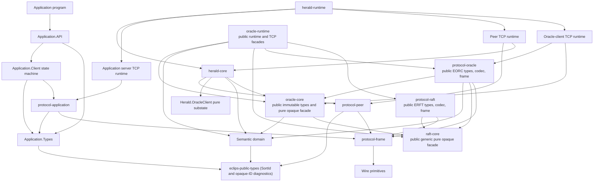

# Ownership and implementation boundaries

This document owns the target module boundaries. Names are conceptual Haskell
component names; exact Cabal package names may change, but ownership and dependency
directions are normative.

## 1. Boundary principles

1. There is no process or value containing every Herald's local state.
2. Herald-local state is changed only by one serialized pure Herald transition.
3. Oracle state is changed only by applying a committed Oracle command or a
   sealed, committed Raft configuration observation.
4. Raft knows bytes, client request identity, and log positions; it does not know
   ECLIPS objects, labels, graphs, or publications.
5. Network codecs decode untrusted DTOs. Stateful semantic admission runs
   inside a pure machine against an explicit state projection; decoding never
   constructs trusted internal state directly.
6. Runtime code interprets effects but does not decide semantic outcomes.
7. Derived indexes and caches can be rebuilt from their owning state.
8. One protocol plane's message type cannot be decoded or admitted as another
   plane's message.
9. Application-facing facade modules must own real narrow types or functions. A
   set of small facades that all re-export one large internal state machine does
   not satisfy this specification.
10. Plans and progress ledgers are not runtime architecture. Compatibility
    adapters, version negotiation, migration checks, and mixed-build support do not
    belong in this internal prototype at all.
11. `Application.Client`, `Herald.Core`, `Oracle.Semantics`, and `Raft.Core` are
    functional cores with concrete pure transitions. Their runtime packages are
    capability-based shells and are the only packages that perform I/O or concurrency.
12. Every external result that can affect a kernel returns as a typed input
    through that kernel's serialized input path. An interpreter never calls a leaf
    transition or mutates kernel state directly.
13. Shared coordination between concurrent runtime tasks uses STM, but each kernel
    state has one exclusive task owner and is not shared through STM.
14. Profile 0.1 places no semantic size, count, depth, node, frame, DTO, or effect
    batch ceilings on conforming data. It has no semantic capacity accounting,
    capacity reservations, saturation states, or capacity-exceeded application
    rejection. Runtime queues have no configured capacity; host memory or resource
    exhaustion ends the experimental run outside ECLIPS semantics.

The existing `MultiHerald`, `synchronizeAll`, `synchronizeOracleState`, global
delivery queues, and fixture scheduler MUST NOT be dependencies of a target
component. A test harness may run several independent Herald machines, but must
communicate with them solely through specified messages and effects.

### 1.1 Haskell abstraction policy

New target components use GHC2024 as their minimum language edition rather than
restricting themselves to Haskell 2010 or an artificially basic subset. Additional
well-supported extensions and libraries are permitted when they make an invariant,
ownership boundary, or reusable mechanism clearer. The implementation is expected
to use abstraction to preserve overview as the system grows; duplicated concrete
code is not inherently more explicit.

Preferred tools include:

- nominal `newtype`s and closed algebraic data types that prevent identity-domain
  confusion and make invalid states unrepresentable; instances are derived only
  where their meaning is valid;
- parameterized data structures, pure state machines, and combinators for repeated
  mechanisms such as checked representation wrappers, persistent sequences,
  deduplication, acknowledgements, staged visibility, and request/result caching;
- small coherent type classes or explicit records of operations when there are
  genuinely substitutable implementations with stated laws, rather than omnibus
  `HasX` constraint sets or a `MonadHerald` class;
- higher-kinded types, GADTs, data kinds, type families, and similar facilities when
  they encode a real phase, role, or relationship more clearly than runtime checks;
- optics or equivalent update combinators within a state owner, without exporting a
  way to bypass that owner's checked transitions; and
- deriving and generic programming for mechanical instances and structural
  traversal, but never as the definition of a wire format or semantic decision.

An abstraction must preserve the named owner, admission point, and visible
effects of the code it replaces. It must not collapse distinct identity domains,
turn all Herald work into one generic command algebra, export lenses into opaque
substate, or hide partiality and I/O behind an unconstrained interface. The pure
kernels MUST NOT depend on `IO`, `MonadIO`, STM, sockets, clocks, entropy,
persistence, thread primitives, or an effect row.

Runtime effects remain narrow capabilities such as transport, clock/timers,
entropy, supervision and diagnostics. `HeraldEffect`, `OracleEffect` and sealed
Raft outputs are concrete data returned by pure transitions. Effects-library
dependencies belong only in shells and must not turn kernel transitions into
effectful programs. The Herald shell uses scoped `IO` capabilities and STM;
its concrete capability boundaries expose the owner and queue linearization points.

Target semantic code is total. Partial patterns, unchecked indexing, `head`,
`fromJust`, `error`, and `undefined` do not express invariant faults; use checked
constructors, checked or non-empty types, exhaustive matches, and typed errors.

Every reusable abstraction that affects semantic state, ordering, admission, or
protocol progress states its laws and has property tests at that level. Abstraction
is justified by the current design and its real variation points; it need not
anticipate deferred features merely to appear maximally general.

## 2. Top-level components



No arrow may be reversed. In particular:

- the semantic domain imports no runtime, socket, clock, random, protocol-plane,
  or Raft module; its `cereal` dependency implements only canonical semantic bytes
  and normalized digest transcripts;
- `eclips-public-types` owns domain-neutral public identities such as the exact
  32-byte `SortId` carrier, the grouped-hex diagnostic renderer, and the shared
  pure raw descriptor encoding, hashing, and predefined catalogue. It imports
  neither the semantic domain nor application types. `Application.Types` and the
  semantic domain both use that one codec; the semantic domain retains checked
  descriptor admission, and possession of raw descriptor bytes proves no admission;
- `eclips-raft-core` is one public pure-kernel library over opaque application
  and configuration metadata bytes. It owns checked Raft identities/genesis,
  stable/joint configurations, exact catch-up observations, inputs, effects, opaque state,
  and the transition facade, while hiding state constructors and prepared
  internals. It imports no ECLIPS semantic, Oracle, protocol, runtime, socket,
  clock, or entropy module;
- `eclips-protocol-raft` is one public ERFT types/codec/frame library. It depends
  only on `eclips-raft-core`, `eclips-protocol-frame`, and ordinary pure support
  libraries; it imports neither Oracle nor runtime modules;
- `eclips-oracle-core` is one public pure-kernel library. Its immutable command,
  canonical-byte, receipt, and projection types are shared with the checked
  protocol and Herald adapters; its Oracle state remains opaque and is changed
  only through the public pure initialization/input/effect/transition facade.
  State constructors and prepared internals remain unexposed. It depends downward
  on the semantic domain and the public `raft-core` identity/configuration facade;
  the latter edge lets Oracle own the checked voter/co-host binding and
  `RaftConfigurationDigest` without teaching Raft any ECLIPS domain type. It never
  depends on Herald, protocol, runtime, socket, or STM modules;
- `eclips-protocol-oracle` is one public EORC types/codec/frame library. It depends
  on the public immutable/admission facades of `eclips-oracle-core`, the semantic
  domain, and `eclips-raft-core`, plus `eclips-protocol-frame` for framing; it
  cannot import Oracle or Raft state/transition internals;
- `eclips-oracle-runtime` exposes the public `Eclips.Oracle.Runtime`,
  `Eclips.Oracle.Runtime.TCP`, and current-build
  `Eclips.Oracle.Runtime.ConformanceClient` facades. The last is the authorized
  non-application submission seam used by cross-package acceptance tests;
  it carries no compatibility promise. Raft/Oracle owners, adapter, dispatchers,
  timers, connections, watch ledger, supervision, and conformance-client state
  remain package-private. This is the package that depends on both cores
  and both protocol packages, and it also consumes the semantic domain types used
  by checked composition;
- `eclips-herald-core` depends on `eclips-oracle-core` only for the immutable
  Oracle-facing types consumed by its OracleClient/projection transition.
  `eclips-herald-runtime` additionally depends on `eclips-protocol-oracle` for its
  EORC lane. Neither Herald package depends on `eclips-raft-core`,
  `eclips-protocol-raft`, or `eclips-oracle-runtime`;
- application code imports only `Application.API`; `Application.API` delegates to
  `Application.Client`, and neither imports Herald state or peer/Oracle protocol
  modules. No application package gains an Oracle or Raft dependency; and
- the Oracle imports no Herald store, graph, alignment, wait, or publication queue
  module.

## 3. State ownership

| State or fact | Authoritative owner | Copies or projections |
| --- | --- | --- |
| `SystemId` and predefined catalogue digest | Deployment manifest and Oracle genesis | Checked immutable copy at every role. |
| Checked index-zero process/root assignments | Selected trusted genesis configuration | The common initial projection retains only admitted initial assignments. Unused local templates are excluded from live parity claims; dynamic Start retains fresh Herald-generated process/epoch identities and carries no root manifest. |
| Nominal `SortId` and canonical descriptor encoding/hashing shared with applications | `eclips-public-types` | The application binding computes expected identities and the semantic domain independently admits descriptors using the same pure codec. `Application.Types` re-exports the same identity type unchanged. |
| Initial Raft voters and native timer policy | Raft genesis | Checked immutable initialization at every replica. Subsequent log-effective voting authority belongs to the native configuration log; committed bindings belong to Oracle's ordered projection. |
| Registered `RaftNodeId`/Herald bindings, committed voter configurations, and accepted voter-host-failure evidence | Oracle | Retained control-watch projections at Heralds and replica adapters. Transport discovery supplies only provisional contacts/bindings; it cannot manufacture a registration, configuration observation, or failure certificate. |
| Fresh Oracle quorum-health observations and their local correlation generation | Native owner projections interpreted by the Herald health observer | Effective configuration reference and exact voter sets qualify every observation. Herald isolation counts matching fresh replies under both joint majorities; an EPRP socket, local co-location, or old response supplies no health evidence. |
| Raft term, vote, log, commit index | Each Raft replica | Replicated by Raft; never copied from a Herald peer. |
| Initial active Herald set, current membership generation, and retired `HeraldEpoch`s | Oracle genesis plus the ordered Oracle membership transition | Immutable genesis and monotone applied generation history at every Herald; Discovery cannot add or reactivate a member. |
| Canonical index-zero `InitialProjectionDigest` | Each checked startup fixture and its `OracleProjection` | It binds the complete applied bootstrap records plus the normalized checked common Graph projection; peer compatibility compares it and terminates on mismatch before data admission. |
| Checked initial topology projection | The startup checker resolving the trusted symbolic fixture | Every Herald installs the same vertices and universal preserving edges; resident owners retain only their local Application, Controlled, Placement, and Store facts. |
| Isolated index-zero `SystemBootstrapWriter` identities | Checked genesis topology | These identities have no application alias, normal possession, or live publication-source arm. Dynamic Start creates no roots. |
| Selected startup names and optional `environmentSources` | The resident `Herald.Application` owner, with normal grants admitted by `Herald.Controlled` | Startup retains exact private keys and the fixed Nabla/Delta writer-source pair. `newenv` rechecks ordinary operation on those sources and rejects when the pair is absent; it cannot borrow hidden genesis authority. |
| Peer addresses learned from seeds | `Herald.Discovery` | Gossip hints at peers; not Oracle authority. |
| TCP connection and byte-buffer state | Transport runtime | No semantic copy. |
| One Herald's complete `HeraldState` product | Its single Herald kernel task | No `TVar`, socket task, effect interpreter, or diagnostic reader receives the state. |
| One replica's `OracleState` | Its single ordered Oracle-application task | Other co-hosted roles communicate by typed messages only. |
| One replica's `RaftState` | Its single Raft runner task through `Raft.Core` | Socket and Oracle-adapter tasks receive only typed messages and never inspect or mutate Raft state. |
| Ingress/effect/outbound queues, connection generations, fair-arbiter cursor, and worker lifecycle | The relevant runtime shell using STM | These facts coordinate tasks but carry no independent semantic decision. |
| Armed physical timers | Timer interpreter keyed by logical timer identity and attempt generation | A firing is only a typed time observation to a kernel. |
| Process identity, epoch, residence, and canonical liveness | Oracle | Applied projection plus a home-process record at the resident Herald. |
| Process-private `PrivateUniqueId` ↔ `GlobalUniqueId` bijection and never-reused next-local counter | `Herald.Application` at the resident Herald, keyed by `ProcessEpochId` | Shared by every session of that process epoch; application clients hold only private IDs. |
| Live application sessions, unretired request receipts, inclusive receipt frontiers, and session/request bindings | `Herald.Application` at the resident Herald | The client owns pending correlations and receipt-consumption progress; completed results belong to caller-owned handles. It does not own the process map or canonical process End. |
| Administration request correlations, typed request digests, accepted/terminal statuses, conflicts, and result-query state | `Herald.Administration` at the addressed Herald | `OracleClient` owns only any resulting Oracle intention; a connection owns no semantic result, and application sessions cannot issue or query administration work. |
| Accepted wait registrations and wake state | `Herald.Wait` at the resident Herald | `Application.Client` owns only its pending local call. |
| Client startup attempts, pending calls, terminal-result delivery, and receipt-retirement progress | `Application.Client` | Herald owns live-session admission and unretired request results. Established connection loss ends the client session. |
| The profile-0.1 global-unique-ID generator's checked 32-byte AES key, private 24-byte prefix, and next 64-bit counter | `Herald.IdGenerator` | `Herald.Application` retains accepted global IDs in process mappings and pending environment manifests; `Herald.Controlled` additionally owns nabla-bound reservations. The generator owns no emitted-ID registry and its outputs are not scanned against other owners. |
| Decode-only checked descriptor cache; effective `SortId` to canonical descriptor bytes and `SortDefinitionOccurrenceId`; duplicate observations | `Herald.SortRegistry` | Effective entries derive from genesis-seeded primordial replicas and regular `sort-sort` publications/alignment, including their checked semantic replay into newcomer system views; a descriptor response or bytes retained with a controlled value are not sort visibility. |
| Controlled ID-to-sort binding, locally known current/obsolete state, obsolete suppression, publisher-retained value/strength, and possession | `Herald.Controlled` at each Herald that has admitted the object or retained its history | These facts arrive through direct publication/alignment and converge asynchronously. They are not an Oracle projection. A first checked controlled publication establishes the immutable ID-to-sort binding locally; a later obsolete instance advances a monotone local state that delayed current data cannot reverse. |
| Canonical released labels, label revisions, and authority changes established by `label` | Oracle | Applied label/process projection at every Herald, overlaid on locally known controlled values and retained even where no value copy is visible. The Oracle does not thereby certify that the object exists, is current, or has not become obsolete elsewhere. |
| Nabla-bound controlled-ID reservation phase and publisher-retained possession | `Herald.Controlled` | First publication and reservation deletion are competing local winners: one serialized transition consumes `Reserved`, installs the local controlled object/history, and emits the publication without an Oracle intention or intermediate lifecycle decision. Bare `newid()` leaves no controlled state; every process-private alias remains owned by `Herald.Application`. |
| Normal/weak possession from local publication or replicas | `Herald.Controlled` plus `Herald.Store` projections | Pure capability derivation combines them; not consensus state. |
| Reconciled graph, unresolved definitions, per-origin structural applied frontier, peer-advertised frontiers, and sealed retired-source union | Each Herald | Eventually convergent and never copied as an authoritative whole. Each Herald derives it from admitted structural history plus the topology-affecting projection of the applied Oracle prefix. Oracle admission retains cut/vector claims, but Herald owners reproduce their graph meaning. A `TopologyCut` binds its membership generation, componentwise `StructuralVersionVector`, applied control prefix, and canonical topology-occurrence digest. Retirement establishes the survivor-retained source union; admission extends an established old-member cut with the exact six-view contribution and an empty newcomer component. |
| Active delta-to-Herald/store placement and the Herald's positive placement sequence | Hosting Herald / `Herald.Placement` | Advertised and cached by peers; checked against Oracle process residence and current membership. An alignment cut normalizes exactly one sequence for every active-generation Herald in ascending `HeraldEpoch` order. |
| Visible and retained delta stores, including one private predefined-carrier system view per role; zero-based retained-change revisions; destination-free retained history with exact source, sort-occurrence, topology, and control evidence | Hosting Herald / `Herald.Store` | Alignment transfers immutable semantic snapshots and revisioned transitions, not ownership or receiver-qualified publication batches; genesis derives each private view's delta/incarnation identity without inventing controlled or placement facts. |
| Publication counters, Herald-wide acceptance positions, semantic publication identity, frozen route, unsequenced structural-admission stages, and each Herald's next structural sequence | `Herald.Publication` with readiness facts from `Herald.Graph`/`SortRegistry`/`Visibility` | Stable publication IDs survive a dependency-held stage, but a structural occurrence/stamp is allocated only when its local prerequisites are applied. Oracle admission retains exact sealed input/stamped-prefix claims, never the allocation owner or publication payloads. |
| Acceptance-time caller/object publication groups, local/unassigned counts, and conservative per-destination completion frontiers | `Herald.Publication.Groups`, embedded in `Herald.Publication` | Membership captures the issuer, immutable writer sequencing object, and published controlled object. Dispatch certification commits local effects and destination maxima together; Completed acknowledgements, Resume completion, and canonical retirement update the readiness index. Sparse peer completion/reclamation remains in `Herald.PeerStream`. The unstamped count controls label eligibility; exact caller/object settlement precedes the atomic Oracle decision. |
| Positive per-direction peer-stream sequence, greatest advertised source frontier, explicit received and derived completed prefixes, sparse certified completion, pending typed inbox/outbox items, exact gap state, and logical dispatch-attempt correlation | `Herald.PeerStream` | TCP runtime owns only encoded frames, connection buffers, and physical attempt execution/outcomes; Publication owns an item's meaning but not its stream assignment. |
| Outstanding Oracle proposals, leader hints, request retries, and contiguous watch cursor | `Herald.OracleClient` | Oracle owns command receipts and its canonical process/label/evidence-workflow state. |
| Occurrence-qualified structural consequence debts; post-cut promotion into unsourced obligations; canonical class-generation cuts; retained alignment-cut announce/acceptance evidence, readiness certificates, and later certificate-qualified attempts | `Herald.Alignment` at each participating Herald | A debt exists before the future topology/placement cut; it is promoted only after those inputs exist and before any context request. An obligation binds cause, destination generation/stores, source class, and frozen path strength but no supplier/certificate. Only the selected attempt is supplier-qualified. Cut evidence and certificates have repairable peer delivery; the source retains exact transfers until acknowledgement. |
| Positive per-destination alignment delivery sequences; indexed unconfirmed acceptance/readiness payloads; sparse received high water and gaps; binding-independent catalogue-seeding status; dirty progress and idle-flush timer correlation | `Herald.PeerDelivery` with the pure `UseCase.PeerDelivery` coordinator | Semantic admission or exact dependency retention authorizes a receipt. Opposite-direction receipt headers reclaim delivered payload and key-index entries; they do not certify source readiness or reclaim semantic alignment history. The runtime only interprets sends and timers. |
| Label workflows, captured member cuts, reports, terminal outcomes, failure probes, membership generations, and retirement tombstones | Oracle | Fence, preparation, release, membership, and resident-process-End projections at Heralds; survivor structural union and data-owner loss handling remain outside Oracle. |
| Pending Herald manifest, exact old-member seal and readiness, activation or cancellation | Oracle Admission | Herald Join owns source captures and installed semantic evidence; Graph checks the candidate base. A pending catalogue entry grants neither ordinary membership nor a vote. |
| Immutable source capture, staged semantic history union, and correlated admission command results | `Herald.Join` | One Herald worker interprets restricted onboarding. Receiver-owned stores and Graph admit history; runtime callbacks exchange bytes through typed owner ingress. |
| Local disappearance/reclamation cuts, evidence, matching-write gates, and regular-definition retirement suppression | `Herald.Disappearance` | Oracle owns only the evidence-workflow outcome; this substate owns one Herald's data-plane proof and application. Obsolete-object suppression itself remains in `Herald.Controlled`. |
| Held source-authority-, label-, retirement-, dependency-, and post-fence publications | Herald visibility state | Payload is never copied into Oracle. A target object's creation/current/obsolete state is not an Oracle prerequisite. |
| Local monotonic clock observations | Herald or Raft runtime using the clock | Passed into pure transitions as explicit values. |

An apparent convenience that moves an item to a different owner needs a
specification change. For example, putting publication payloads in an Oracle
command, deriving membership from peer gossip, or deriving possession from the
Oracle is not an implementation shortcut.

The `StructuralVersionVector`/`TopologyCut` graph cut is the initial profile-0.1
model. A deliberately
narrow fallback is reserved if property/model checking shows that canonical
peer-to-peer generation lineage is disproportionately complicated: the Oracle may
order a compact activation record containing only a structural occurrence identity
and publication digest. Such a positive `TopologyActivationIndex`, nominally
distinct from `ControlIndex` and incremented only by accepted activation tokens,
would provide one scalar topology
order, but would neither approve/reject the publication nor carry its payload,
establish Herald-local application, select an alignment source, or prove historical
readiness. Adopting that fallback requires an explicit specification change; it is
not current state or an optional second path.

Concretely, each structural publisher owns its monotonically increasing origin
sequence. Each Herald's Graph/reconciliation owner advances one applied component
only after the corresponding structural effect and its finite local consequences
have been installed. It advertises that applied vector to peers and retains the
latest vector advertised by each peer when it needs decentralized all-member
stability; a context requester needs the exact installed established cut and the chosen
supplier's retained `AlignmentCutAccepted` for the exact
combined topology/placement cut, and its matching historical-readiness certificate.
Oracle state contains none of these vectors.

Profile 0.1 retains obsolete suppression conservatively for the finite run. A later
safe-reclamation workflow may ask every Herald in one captured membership
generation for cut-qualified evidence that it recorded the obsolescence and
drained all earlier current publications, and may combine that evidence with the
specified bounded-latency/clock-synchronization
horizon. The Oracle may order the resulting common permission to discard the hidden
state; it does not decide whether the obsolete publication was valid or make the
object obsolete. Until that proof and protocol exist, neither timeout nor local
absence permits reclamation.

## 4. Semantic domain

The semantic domain exposes total operations and opaque checked values. Small total
primitives SHOULD be composed through domain abstractions that make recurring
invariants and transformations visible rather than duplicated as hand-written
plumbing. It covers:

- sort descriptor validation and canonical identity;
- the closed portable descriptor AST, including non-empty distinct ordered enum
  schemas, and its total evaluator;
- values, keys, predicates, total ranks, and lifecycle classification;
- graph definitions, universal-edge reachability, typed destination selection, and
  per-sort context obligations;
- publication validation and frozen routing cuts;
- visible/retained store application and `local-take`;
- capability derivation;
- predefined-value decoding and entity reconciliation; and
- label transition validation independent of transport.

Within the common controlled-object representation, the checked prototype
edge-specific payload contains only source, destination, and preserving/weakening
strength. Strength is the enum `preserve :| [weaken]`, not an integer-valued
application field. It has no sort predicate or filter field, and every edge is
traversable by every sort. An edge form with a selector, an undeclared strength
symbol, or any unsupported field is rejected before graph mutation. Nabla/delta
sort equality remains the independent condition that selects publication sources
and destination stores. `Herald.Graph` must not hide a dormant filtering branch
behind its interface.

It owns no application sessions, peer directory, request retries, barrier progress,
or Raft state. Graph algorithms may recompute reachability and SCCs from scratch in
the prototype. Correctness and clarity take precedence over incremental cleverness.

Checked constructors hide representations that carry invariants. Tests requiring
malformed values use a separately named fixture component rather than exported raw
constructors.

## 5. Application boundary

### 5.1 `Application.API`

The application-facing package contains:

- structurally checked `PrivateUniqueId` values and nominal process-local process,
  object, nabla, and delta handle types needed to express the eight operations;
- an application-value representation whose unique-ID fields contain only
  `PrivateUniqueId`, and whose enum values carry exact text symbols;
- the closed input-only `ApplicationWriteValue` contract
  `PublishValue(ApplicationValue) | DeleteReserved(PrivateObjectId)`, with delete
  never a generic application/internal label or result value;
- a structured `ApplicationSortDefinition`/`ApplicationSortDescriptor` boundary
  form with either an application-selectable draft and optional public `SortId`
  claim or one closed predefined-role reference. The typed application binding
  checks and hashes its complete definition through the shared public codec; the
  Herald independently delegates semantic admission and identity verification to
  the semantic domain;
- a `NewIdTarget` sum with `BareNewId` and
  `ControlledNewId(PrivateNablaId)`, plus the retained
  `NewIdCompleted(PrivateUniqueId)` result;
- `WriteResult.SortDefinitionWritten(SortId)` and identity-free
  `WriteResult.WriteAccepted` success branches, through which a sort-definition
  write returns its Herald-derived public identity and reservation deletion
  reports semantic acceptance, including on exact retry;
- `ApplicationLabel = (ApplicationLabelOwner, Word64)` with process/zombie owner
  arms containing `PrivateProcessId` and a void owner, including typed label-schema
  query literals;
- query and result types;
- exactly the eight functions listed in
  [01-semantics.md](01-semantics.md#5-the-exact-application-api);
- a separate lifecycle surface for preparing a local child, observing readiness,
  cancelling an unclaimed preparation, and ending the caller's own process; and
- connection/configuration construction that is clearly transport setup rather
  than an ECLIPS operation.

It does not expose `GlobalUniqueId`, `GlobalObjectId`, Herald IDs, store
incarnations, publication IDs, control indices, peer messages, decision-progress
commands, or wait registrations. It does expose `SortId`, because a sort is a
shared content address rather than a private or controlled identity.

The current query grammar is a Boolean expression over non-empty scalar field
projections with bool/int64/bytes/text/enum/private-unique/private-label literals.
It contains no global identity. `EnumSchema` carries a non-empty ordered list of
exact text symbols; semantic admission rejects duplicates. `EnumValue`,
`LiteralEnum`, and `QueryEnum` carry one exact member. Result order is fixed by
internal `(DeltaId,ObjectKey)` before recursive localization; duplicates from
distinct stores remain distinct. The predefined definition form re-materializes
only an immutable catalogue member and exposes no canonical bytes or arbitrary
Herald-only policy field.

Comparisons use the owning semantic scalar order (numeric for integers,
lexicographic for bytes/text/unique IDs, and the closed void/process/zombie label
order). Enum comparison, key order, and explicit enum rank fields use the member's
ordinal in its owning schema; declaration order is therefore semantic, and
reordering members changes `SortId`. Unlike scalar types are never compared.
Because the public structured sort-definition value deliberately hides its
two-field internal carrier, a query over `sort-sort` admits Boolean constant
composition but rejects projected comparisons; this boundary cannot be used to
recover canonical descriptor bytes.

The library may internally open, close, cancel, retry or query a request on a live
session, retire consumed receipts, or follow an Oracle-backed result through its
Herald. These bookkeeping verbs and the separate lifecycle surface do not add
data-space operations. Applications recover from an established connection loss
by restarting with a new lifetime.

The facade exposes an opaque scoped `Herald` through `Eclips.Application`, with direct
per-operation results for all eight calls. `prepareChild` accepts a local or
admitted remote target and returns a `PreparedChild` containing a preparation
reference, parent-private process handle and opaque `ConnectionDescriptor`.
`awaitChildReady`, `cancelChild` and `endProcess` retain their distinct lifecycle
completion. `Eclips.Application.Advanced` provides result-indexed operations and
opaque `Call a` / `LifecycleCall a` handles for concurrency and inspection.
Its `BeginChild` witness exposes source acceptance before preparation completes.
The descriptor contains the target locator and checked lineage, Herald epoch and
attachment bytes; it is connection material, not a global object handle.
`Eclips.Application.Connection` supplies canonical text encoding and checked
parsing without another representation or compatibility decoder.

The application-type increment adds `Eclips.Application.Types.Typed` and
`Eclips.Application.Typed` above those existing operation and lifecycle owners.
`ValueType a` derives one representation from records, nested records, transparent
newtypes, or closed nullary enums in the existing value grammar. Its schema is
also the source of nominal `Field a b` witnesses and the codecs. An
`ApplicationSort a` instance supplies the complete key, rank, validity,
obsolescence, retention, and controlled-object policy. The opaque `Sort a`
contains the checked descriptor and its locally computed canonical identity;
different host types with the same descriptor have the same `SortId`.

Endpoint definitions are immutable: the predefined controlled-sort policies
reject subsequent writes to an existing endpoint definition. Creation retains
the declared sort, and binding a startup name compares the expected identity with
the actual carried `SortId` in the Herald-produced startup grant. Public startup
DTO constructors do not manufacture a trusted handle: binding reads only the
startup state retained by the connected opaque `Herald`. Nominal `Nabla a`,
`Delta a`, and `Query a` handles retain their session owner, and multi-handle
operations reject mixed sessions. This runtime ownership check does not claim a
static session brand for identities embedded inside arbitrary application values.

Typed reads and local takes decode into the application type; typed predicates
lower to the existing closed query or descriptor AST. Query literals permit
private identities and labels while descriptor literals exclude them. The
advanced typed call retains the original invocation and result cell; decoding or
repeated observation never resubmits a mutation. These conveniences add no
data-space operation or protocol version. The
[application types](../../application-types/README.md) and
[application API](../../application-api/README.md) document the supported shapes
and typed facade; both runnable examples use it.

The lower-level `preparedApplicationConfiguration` supplies a descriptor and one stable
`InitialClaimId` to the existing scoped `withApplication` runner. The pure client
retains that exact claim across initial transport retries. `recoverEndProcess`
uses a retained lifecycle request identity to query an own-End outcome without
opening or resuming the ended session. It cannot issue a new End or retrieve an
unrelated request. Waiting for a lifecycle call is a local observation; abandoning
the waiter does not cancel its accepted work.

Before exposing prepared startup access, the client sends `RetireReceipts` with
empty progress on the same TCP connection and waits for `ReceiptsRetired`. This
confirms receipt of the initial session material even for an idle application.
Startup retries preserve the exact initial claim while readiness is pending or
its outcome is unknown; they cannot resurrect a session after the Herald has
observed loss of its established binding.

The API being thin constrains its exported surface, not the abstraction level of its
implementation. Shared session, request, retry, and response machinery SHOULD be
factored rather than repeated once for each operation.

`Application.Client` is a small pure client/session machine interpreted by the
language binding's TCP runtime. It owns connection/session establishment,
request-ID allocation, pending calls, exact live-session retry, wait cancellation, and
mapping asynchronous RPC frames back to all eight current application-facing
calls. It also owns stable initial claims and the separate lifecycle request,
status, exact-retry, and restricted own-End recovery machine. A lifecycle identity
contains the admitting session's opaque scope, session ordinal, and a request
ordinal, so two sessions for one process cannot collide. It does not decide
semantic rejection or inspect a peer/Oracle message.

For its current pure command boundary, the caller supplies strictly increasing
nominal local invocation correlations that never enter a DTO or Herald state.
A compact high-water value rejects reuse or regression; wrong-phase commands are
also typed local errors with no successor. Pending maps associate those
correlations with separately owned request IDs. Terminal result effects transfer
payloads into caller-owned handles before the client advertises receipt retirement.
The client then removes terminal request, lifecycle, and cursor observations from
its shared maps, retaining pending correlations and compact sequence facts.

Ordinary and lifecycle receipts have separate optional inclusive retirement
frontiers. The client piggybacks them on later calls and flushes them explicitly
when idle. The Herald admits both frontiers atomically, rejects a prefix covering
pending work, and reclaims covered terminal receipts and copied summary entries.
Late calls and lookups at or below a retired frontier return an explicit retired result.
Receipt reclamation does not remove accepted semantic work: child preparation,
publication, and Oracle workflows retain the facts their semantic owners need.

The current client/codec surface exposes exactly eight operation names:
`newid`, `newenv`, `write`, `forward`, `read`, `local-take`, `wait`, and `label`.
The sole `ApplicationOperation` sum and its eight results are shared by the
client, EAPP codec, Herald, and callable API. `ApplicationWriteValue` has only
`PublishValue(ApplicationValue)` and `DeleteReserved(PrivateObjectId)`; controlled
and regular publications, sort definitions, and reservation cancellation add no
separate operation.

`Application.Types` owns `PrivateUniqueId`, its nominal handle wrappers,
`NewIdTarget`, the private-ID application-value/query trees, the current closed
input-only `ApplicationWriteValue`, `NewIdCompleted`, and the
`SortDefinitionWritten(SortId)`/`WriteAccepted` write-result branches, plus
exported argument/result types so the API and client can depend on it without a
cycle. Its `Lifecycle` module owns checked opaque locators, connection descriptors,
preparation and claim identities, prepared-child values, and the separate closed
command/result/status vocabulary. These types do not
offer a conversion to any global identity. Ordinary wire-carried application sums
and records derive the current build's `Binary` representation in their owning
module. The selected `text` package's existing `Binary Text` instance performs
checked UTF-8 decoding. Maps and sets use the stock instances under the same-build
typed-producer assumption. Opaque refined
carriers decode through their checked constructor, so deserialization cannot
create zero private IDs or wrong-width public identities. This representation
plumbing creates no dependency on a protocol, Herald, Domain, runtime, or
global-identity package and makes no stable API or wire promise. `Application.API`
is the thin callable facade over
`Application.Client`; the client, not the API type module, depends on
`protocol-application`. On the server side, application/admin/peer/Oracle TCP
runtimes decode only their own protocol DTOs and submit role-tagged inputs to the
`Herald.Runtime` composition root. They do not import a Herald leaf substate.

### 5.2 `Application.RPC`

This component owns the closed generic application envelope, bookkeeping DTOs,
length/family framing, and decode admission for application-to-Herald traffic.
Ordinary DTO sums and records derive `Binary` directly and reuse the application
types rather than mirroring their AST. A decoded complete body must leave no
decoder residual before it can reach the client or Herald adapter. Refined-value
and request-summary instances have already validated their structural
constructors. Stateful session, request, identity, and semantic admission remains
in the pure owners.
Operation payloads contain private IDs and private-ID application values, never
global IDs. The `write` contract is
`PublishValue(ApplicationValue) | DeleteReserved(PrivateObjectId)`.
`DeleteReserved` is not admitted in another
operation, value tree, query, or result. A structured sort-definition success is
`WriteCompleted(SortDefinitionWritten(SortId))`; the server obtains that ID only
from Herald semantic admission. A reservation-deletion success is
`WriteCompleted(WriteAccepted)`, with no object or global identity. Bare and
controlled generation both complete as `NewIdCompleted(PrivateUniqueId)`. The
server encodes and retains those results unchanged for exact request retry, then
admits a decoded first-seen call by resolving its session and converting the
single operation union to `Herald.Application.Input`.

The RPC schema encodes the eight-operation union plus open/resume/end,
request-result lookup and wait cancellation bookkeeping. Neutral opaque claims
represent attachment, session, token, wait and cursor values; structural checking
neither imports nor establishes Herald/Domain identities. One reviewed Herald
adapter performs exhaustive claim conversion and leaves semantic ownership checks
to the pure transition.

The current EAPP envelope also carries initial claim and lifecycle messages,
separately from the unchanged eight-arm `ApplicationOperation` union. A claim
pending on readiness has no logical session; its physical lane may run heartbeats.
Successful claim installation and its retained `SessionOpened` are one pure
transition. Lifecycle request/result identities are independent of ordinary reply
cursors and have their own retirement frontier. Explicit lifecycle lookup serves
unretired results on a live session; established connection loss ends that
session's reply reachability.

The RPC protocol may mention a request or wait identifier. It never carries a
peer publication, `GlobalUniqueId`, `GlobalObjectId`, Oracle command, Raft entry,
or trusted internal `World` value. `SortId` may cross this boundary unchanged.

### 5.3 Process identity map

`Herald.Application` creates the process map when it applies that process epoch's
checked startup grant, before any session can open. Selected global identities are
localized once in deterministic key order, so later sessions share the same typed
startup access. The closed genesis environment retains its canonical root order.
`OpenSession` and `ClaimInitial` allocate only session/request/wait/resume state;
neither allocates or clones an identity map.

Globalization and localization are pure prepared transitions over the process map.
For `PublishValue`, they traverse the complete checked
application-value tree, preserve non-ID fields,
reuse existing bindings in either direction, and install all newly localized
bindings together with the result that exposes them. If any application-provided
private ID is unmapped, the whole application call is rejected without a partial
semantic successor. The representation invariant is a bijection, and the
next-local counter is strictly above every private ID it has allocated. No
transition deletes or rebinds one entry while the process epoch lives.

`newid` prepares exactly the next private slot and one generated
global ID, then commits the new bijection entry, local-counter successor,
generator successor, retained `NewIdCompleted` request result, and process
acceptance position atomically. Controlled `newid` adds the matching pristine
reservation in that same complete Herald successor; bare `newid` does not touch
`Herald.Controlled`. Every ordinary rejection is decided before either counter is
prepared, and exact retry returns the retained result without another advance.

`DeleteReserved(o)` instead resolves only the typed nabla/object operands and
requires the exact pristine `Reserved` state from `newid(p)` at the current
authority epoch, with no competing first publication. Its accepted
transition makes the delete branch the single winner and consumes that reservation
while retaining the process alias; it constructs no semantic value, publication,
store/outbox work, or Oracle command. The arm is invalid for
regular writes, updates, existing objects, and any non-write DTO position. The owner retains `ConsumedByDelete` as terminal single-winner evidence and returns
`WriteAccepted`. After both private operands resolve, any absent, consumed,
wrong-process, wrong-nabla, or otherwise non-pristine reservation uses the
redacted `ApplicationReservationUnavailable(privateNabla, privateObject)`
rejection. A retained authority disagreement is an invariant fault; a later valid
authority transition cancels a pristine reservation before installing its
successor. A resolved writer of regular sort uses
`ApplicationNablaSortNotControlled(privateNabla)`; unknown identity, wrong nabla
role, and missing `operate` continue to use
`ApplicationUnknownPrivateIdentity`, `ApplicationNablaRoleMismatch`, and
`ApplicationOperateNotPermitted`. Exact retry follows the retained successful or
rejected branch. A later first controlled `PublishValue` acceptance is the other
local single-winner branch: after all admission checks, one serialized Herald
transition consumes `Reserved`, installs the complete local controlled object and
publisher-retained history, fixes the publication/route, and records the request
result. It requires no Oracle-client intention and has no intermediate pending
lifecycle phase.

Labels are an explicit companion traversal because internal `Value.Label` carries
`ProcessEpochId`, not an ordinary `GlobalUniqueId` leaf. Application process/zombie
labels and label-schema query literals carry `PrivateProcessId`; globalization
resolves its underlying private ID through the same map and then statefully admits
the claimed process role, while localization maps an established internal process
ID back through its same-bit global unique value. Every label is an owner/generation
pair: translation changes only the owner identity and preserves its `Word64`
generation, including void. The label translation and all newly allocated aliases commit atomically with the
surrounding value/query/result transition.

Loss of an established application binding immediately ends that session and
reclaims its reply records and observation waits. An existing sibling session
keeps the shared process map and its private IDs live. Loss of the final session
atomically seals later attachment and retains one idempotent automatic
`EndProcessEpoch` intention; duplicate or stale physical-loss observations cannot
repeat it. Orderly `EndSession` removes only its request/result/wait namespace
and does not itself prove canonical process death. Before the Oracle-backed
`label` call is accepted, its semantic owners and `OracleClient` atomically retain
the complete self-contained invocation and exact Oracle intent. The intent remains
nondispatchable while its preceding source group drains; the distributed barrier
is acquired only when that original request becomes dispatchable. Session end
removes only reply reachability; it cannot drop those owner records, their dispatch intention, or
post-decision label-barrier work. `newenv`, controlled instantiation, current
update, and obsolescence are locally accepted direct/structural publications, not
Oracle-backed calls; once accepted, their retained manifest, local, topology-
stabilization, and outbox work likewise survive loss of the replying session.
`wait` remains explicitly cancellable and has no Oracle intent.

`EndProcessEpoch` ends all sessions and waits, cancels pristine `Reserved`
entries, and discards the process map and its local counter. It does not drop an
already accepted direct publication: publisher-retained state, any unsequenced
structural-admission stage, and any already-created logical outbox work continue
without an application reply. An accepted `newenv` retains its exact manifest and
structural stabilization work under the same rule. It also does not
drop an already submitted `label` workflow; exact dispatch/status query and any
selected publication settlement and installation collection continue until
contiguous Oracle order reaches that workflow's terminal settlement. A provably unsent accepted label may instead
finish under that canonical caller End, preserving its original identity and
preceding publication obligations without inventing an Oracle label result.
Work not accepted before the process/authority
transition is rejected against the new local projection. Nabla
passivation/handoff uses the label fence to separate its pre-transition accepted
publication prefix from later work; it does not retroactively cancel that prefix.
Global values,
controlled identity/history, retained data subject to ordinary process-death
lifecycle rules, and other processes' mappings are not erased by map retirement. A
later process epoch starts a new local namespace even if it reuses a configured
process name or the same local counter values. A Herald restart never resumes its
old epoch or process map. Surviving members may retire an eligible epoch through
qualified failure evidence and required voter exclusion. A replacement joins with
a fresh epoch and receives no old sessions or private maps.

The preparation owner constructs the own-End terminal lifecycle effect before
reclaiming the ended session's terminal receipts, and offers that effect before
disposing the live lane. A lost final reply remains an unknown outcome for the
application. The restricted attachment-and-lifecycle query can observe only a
receipt that is still retained; it returns absent after reclamation and cannot
reactivate a process, recover its private map, or create a session. Accepted child
preparations survive parent End; ending the parent does not cancel its children.

`newenv` has no pending Oracle half. If `EndProcessEpoch` is already applied before
local `newenv` acceptance, the Herald rejects before generating identities or
retaining a manifest. If `newenv` was accepted first, its
`Application.PendingEnvironment`, exact generated manifest, direct structural
publications, and topology-stabilization work continue to their global outcome even
after process termination. The retired process map is not recreated, no private
roots are localized, and no reply becomes reachable after retirement; the globally
admitted structural history remains. No Oracle dispatch, status query, environment
command, new correlation, replacement manifest, or second application result is
created.

## 6. Herald core

`Herald.Core` is a composition of independently owned substates. It is not one
ever-growing command algebra. Its exposed transition has the shape:

```haskell
stepHerald
  :: HeraldInput
  -> HeraldState
  -> Either HeraldInvariantFault (HeraldState, EffectBatch)
```

`EffectBatch` is an opaque collection with deterministic member order and no
member-count or aggregate-payload ceiling. It preserves the conceptual meaning of
a finite effect list without exposing its representation at the kernel boundary.

Every external input is syntactically checked and tagged with its established
connection role, but remains an untrusted DTO. `stepHerald` invokes a pure admission
function over the required read-only state projections before constructing a
trusted domain input. Ordinary semantic rejection is a typed application or
protocol result, not an invariant fault.

### 6.1 Herald submodules

Current voter role projection uses the union of committed joint voter-host sets
and the final stable set. Every Herald, including a co-hosted voter Herald,
maintains an absolute isolation grace. Only fresh replies from serialized native
Oracle owners establish quorum health. The endpoint also requires the querying
Herald identity/epoch to remain active in its committed Oracle membership; a
retired epoch cannot use native health to evade its semantic fence after missing
a retirement watch entry. Native demotion alone does not revoke that admission.
A health round carries one owner-minted
correlation and collects the native term, local configuration-observation
generation, effective configuration reference, and exact stable or joint voter
sets. Both joint majorities must reply at the same native coordinate. EPRP
connectivity and a co-located process supply no implicit votes.

The observer keeps a committed configuration floor. Within one native term,
learning an effective joint configuration prevents delayed stable replies from
relaxing its predicate. A later term may establish truncation of uncommitted
configuration entries but cannot cross that floor. Replies from an old round or
older per-node native observation generation are inert, and each new round needs
new replies. Configuration changes and repeated failures never move an existing
absolute isolation deadline. Explicit low-level fixture initialization retains
a five-second grace and a 100-millisecond application drain by default; its round
cadence is one third of grace, capped at one second, and endpoint queries use the
smaller of 100 milliseconds and cadence. Deployment composition
derives grace, cadence and query duration from its shared configurable target:
see the [takeover timing model](../architecture/takeover-timing.md). Its default
five-second target gives three seconds of isolation grace, 250-millisecond rounds,
100-millisecond queries and a separate 500-millisecond drain. These are timing
policies, not resource ceilings.

Failure detection opens only under a stable committed configuration and captures
its exact reporter denominator together with semantic membership. A target voter
remains in that denominator. Fresh strict-majority unreachability for such a
target first retains accepted voter-host failure and normal native exclusion;
only the resulting exclusion permits semantic Herald retirement from that same
certificate. No new probe or recount replaces accepted evidence. A pending
Preparing intention is cancelled idempotently when it blocks a newly suspected
voter-host failure; joint work runs to its committed outcome. Gated recovery
suspicions are reconsidered when the gate clears, without a polling or historical
watch scan. Neither a role update nor a reconnection can undo a local self-fence.

Each direct failure-probe request and echoed response carries the captured stable
Oracle voter-configuration identity in addition to the probe, target epoch, and
semantic membership generation. The peer wire codec checks its nominal 32-byte
claim; the Herald bridge admits the typed identity, while the failure owner checks
it against the committed probe before accepting evidence.

The runtime supplies checked index-zero Oracle configuration and registrations
before constructing its Herald owner, preserving the configured isolation policy
and effect interpreters. Read-only Oracle status and retained voter-change queries
use the same serialized restricted request/reply lane as onboarding. They read
the current owner projection and exact change lookup, not retained watch history
or another thread's mutable kernel state. A reply carries its applied control
prefix; a local read alone is not a fresh Oracle-quorum observation.

Completing a self-fence closes and joins the application writers after bounded
best-effort final disposition delivery. The Herald owner and its control shell
remain alive: fresh administration bindings, local status/result queries, Oracle
watch progress and explicit orderly shutdown remain available. They cannot
restore semantic service or produce new semantic publications. The fence captures
one immutable semantic Oracle projection. Existing graph/application invariants
continue against that cut, while a separate live control cache advances the
contiguous watch, current routing hints, configuration, and status. The fenced
watch path runs no membership, label, failure, structural, or application driver;
late submission outcomes cannot restart abandoned semantic requests. Self-fencing is
not a runtime exit and cannot end a co-hosted Raft scope; committed voter
configuration controls native participation, and explicit shutdown or the
enclosing scope controls physical lifetime.

| Module | Owns | Does not own |
| --- | --- | --- |
| `Herald.Application` | Per-process stable private/global unique-ID bijections and never-reused local counters; recursive application-value globalization/localization; selected startup access and fixed source pair; atomic initial-claim winner/session/result; live-session records, unretired request receipts and inclusive retirement frontiers; request deduplication/status/reply reachability; process-scoped operation acceptance order; the single-winner automatic-End seal/intention after final unexpected session loss; and the process-scoped pending `newenv` manifest/stabilization outcome. | TCP connection objects, clock acquisition, peer data, another owner's controlled state, generation of global IDs, dispatching its retained Oracle intention, or requiring a retired session to retain a publication result. |
| `Herald.ProcessPreparation` | Session-qualified lifecycle request retention; accepted local and remote child selections/grants, exact transfer bodies and target-generated identity; exact Start/End references; preparation, attachment and cancellation phase; readiness requirements and pending claim routes; immutable prepared-child results, lifecycle receipt frontiers, and final own-End reply effects transferred before receipt reclamation. | OS launch, socket ownership, canonical process order, private-map mutation, endpoint labels, or granting operation independently of current Controlled/Placement/Alignment facts. |
| `Herald.Administration` | Authorized administration binding; opaque correlation to retained typed request and canonical digest; monotone `AdminAccepted | AdminCompleted | AdminRejected` state; nonbinding absent lookup, conflict, and result-query handling; process-lifecycle and orderly-shutdown linkage. | Application request/session state, canonical Oracle mutation, bootstrap payload ownership, or treating TCP write/connection lifetime as semantic completion. |
| `Herald.IdGenerator` | One initialization-supplied checked 32-byte generator seed used as an AES-256 key, its deterministically derived private 24-byte zero-excluding prefix, its zero-based next 64-bit counter, and pure deterministic generation of opaque 256-bit `GlobalUniqueId` values. | A registry of emitted IDs, conflict scans, private-ID allocation/mapping, controlled reservations, acquiring runtime entropy, prefix rotation/rekeying, or Oracle allocation. |
| `Herald.Discovery` | Seed addresses, learned contact records, dial intentions, connection tie-break inputs. | Membership, liveness, delta placement. |
| `Herald.PeerLiveness` | Peer recovery generations, absolute deadlines as supplied typed observations, retained suspicion, and fresh probe-attempt state. | Sockets, clock acquisition, membership authority, or deciding retirement. |
| `Herald.FailureDetection` | Stable Open intentions qualified by semantic membership, voter configuration, and recovery generation; fresh direct probe attempts after committed Open; one immutable report per captured reporter; deterministic dismissal or accepted-failure intentions. A pending/joint change suspends new evidence, and gate completion reconsiders retained suspicion. | Changing the captured reporter denominator, treating health observations as failure reports, unilaterally excluding voters, or retiring a voter host before committed native exclusion. |
| `Herald.Isolation` | Irreversible local abandoned-membership/self-fence state for every Herald, its resident-process zombie overlay, and its read-only/terminal drain dispositions. Fresh Oracle-owner health observations use the native effective stable/joint quorum predicate; configuration changes invalidate old observations without extending an existing absolute grace. | Canonical Oracle membership, stopping the co-hosted Raft role, voter-host removal, branch merge, or permission to reactivate the old epoch. |
| `Herald.OracleClient` | Stable outstanding Oracle requests; exact command bytes/digests for dynamic process administration, automatic application-loss End, label workflows, disappearance/retirement, and future obsolete-state reclamation; dispatch intention, leader hints, redirects, workflow queries, and contiguous watch cursor. Committed stable/joint Oracle configuration selects voter routing preference; separately admitted discovery or registration contacts remain dialing hints. | Application request/result ownership, deciding that the final session ended, `newenv`/controlled publication admission, label-barrier state, Raft state, or canonical Oracle mutation. |
| `Herald.OracleProjection` | Last contiguous committed Oracle prefix, finite-run canonical applied entry history/checkpoints needed to reconstruct older stable topology frontiers, and derived read-only membership, process, released-label/authority, and evidence-workflow view. | Proposals, Raft terms, local payloads, controlled ID-to-sort bindings, or current/obsolete object state. |
| `Herald.SortRegistry` | Decode-only checked descriptor cache; effective content-addressed sort definitions and occurrence IDs induced from primordial and published regular `sort-sort`; dependency waiters. | Treating cached/frozen bytes as effective visibility, controlled lifecycle, or descriptor invention. |
| `Herald.Graph` | Reconciled predefined definitions, unresolved dependencies, effective local graph, retained topology-relevant checkpoints/structural history, per-origin applied structural frontier, peer-advertised frontier knowledge, and retained announce/acceptance/established/ack state for the canonical topology-cut chain. | Oracle command order or remote stores. |
| `Herald.Placement` | Local store incarnations and cached peer delta advertisements. | Peer discovery authority or graph reachability. |
| `Herald.Store` | Visible/retained stores, local query/take, store-derived possession, zero-based retained-change revisions, and destination-free retained transition history carrying exact semantic-source/sort-occurrence/topology/control evidence. | Transport retry, Oracle decisions, destination-qualified peer batches, class generations, source selection, or certificates. |
| `Herald.Controlled` | Global-ID/nabla-bound `newid(p)` reservation phase; the local `Reserved -> ConsumedByDelete` or `Reserved -> instantiated-object` single winner; immutable local ID-to-sort binding; monotone current/obsolete/deleted-suppression projection; publisher-retained values/strength; released-label overlay; and local possession projection. | Generating IDs, owning private/global aliases, Oracle dispatch intention, entropy generation, deciding globally released labels, peer byte queues, or concluding that every Herald may reclaim obsolete suppression. |
| `Herald.Publication` | Publication IDs and counters; Herald-wide acceptance positions including canonical consecutive ranges for multi-root origins; frozen routes; retained unsequenced structural-admission stages; the next local positive `StructuralSequence`; self-contained stabilization outcomes; batch/stamped-item construction; incoming semantic deduplication. | Peer-stream sequencing, TCP byte buffering, destination recomputation, or live-session reply ownership. |
| `Herald.PeerStream` | Payload-parametric positive per-direction sequence; greatest advertised incoming source frontier; logical inbox/outbox; explicit empty/non-empty received and completed prefixes; typed structural gap summaries; active payload retention; sparse downstream-certified completion and pending-only assignment indices; exact resume retransmission selection; and logical dispatch-attempt correlation for executable sends. | Publication meaning, route or placement recomputation, barrier decisions, wire encodings/hashes, physical connection identity or attempt execution, timers, or TCP bytes. |
| `Herald.Alignment` | Destination-owned unsourced obligations and later certificate-qualified attempts/subscriptions; canonical class generations whose sole cut digest is `ContextClassGenerationId`; deterministic predecessor/fresh-base selection; retained alignment-cut announce/acceptance facts; semantic snapshots; and readiness certificates. | Store revision/change-log ownership, Oracle membership decisions, application-visible readiness calls, or putting a chosen supplier/certificate into an obligation. |
| `Herald.PeerDelivery` | Logical per-peer immutable acceptance/readiness delivery positions, unconfirmed payload/key index, sparse receive progress, catalogue-seeding status, and idle-flush correlation; the coordinator attaches receipts to controls/publications and replays indexed outstanding work after reconnect. | Semantic generation/certificate authority, publication-stream sequencing, physical TCP ownership, or reclaiming alignment history. |
| `Herald.Visibility` | Source-authority and label/retirement prerequisites, dependency-held publications, label-fence dependencies, and release eligibility. | Ordering an Oracle decision or treating target creation/current/obsolete state as Oracle-owned. |
| `Herald.LabelBarrier` | Home acceptance boundary and selected-publication settlement; target installation ordering; immutable decision and historical installation evidence; membership-qualified direct collection and canonical completion. | Whole successor copies of other leaf substates, stream sequence allocation, Raft consensus, or the canonical label registry. |
| `Herald.Disappearance` | Local disappearance/reclamation probe cuts and evidence, matching-publication gates, and cut-qualified regular-definition retirement suppression. | Oracle workflow decisions, controlled obsolete/deleted suppression, or descriptor visibility. |
| `Herald.Wait` | Level-triggered local wait registrations and wake effects. | A ninth application operation. |

Every substate above is opaque outside its owner. Leaf state modules import the
semantic domain, their own narrow types, and only the explicitly reviewed sibling
views/helpers allow-listed by the module-boundary checker; they do not import an
unreviewed leaf-private record or a use-case coordinator. Read dependencies use
explicit immutable ports such as `OracleView`, `SortView`, `GraphView`,
`PlacementView`, `StoreCapabilityView`, `PeerStreamView`, and `SessionView`.

`Herald.PeerStream` is a payload-parametric private leaf with generated owner
properties. Composed transitions combine stream assignment or receive refinement
with Publication, Store, SortRegistry, Wait, placement and application request
ownership. The item digest binds the complete immutable typed peer item; codecs,
TCP and physical scheduling are separate boundaries.

A port may be a concrete projection record, a constrained interface, or another
typed abstraction. "Explicit" means that its required capabilities and owner are
visible in the type and at the composition root; it does not require manual record
projection and state plumbing at every call site.

Cross-subsystem work is split by use case rather than accumulated in one switch:

- `Herald.UseCase.ApplicationCall` coordinates session admission, capability,
  unique-ID generation, sort-registry/reconciliation for local `sort-sort`
  destinations, disappearance gates, local controlled admission/history, publication, store,
  peer-stream, and wait ports;
- `Herald.UseCase.Administration` coordinates dynamic process lifecycle, retains
  one generated process/epoch identity pair and exact Start intention before
  Oracle submission, installs the applied local process and selected startup
  access without root publication, and handles orderly local shutdown;
- `Herald.UseCase.ProcessPreparation` coordinates checked local selection admission,
  retained Start, child startup and parent process-name grants, required-endpoint
  readiness, initial claim, cancellation, and own-End result retention. The
  administration cancellation handle shares its serialized claim/cancel winner;
- `Herald.UseCase.PeerInput` coordinates stateful peer admission, visibility,
  publication/store application, regular sort induction/hash checks, graph
  reconciliation, disappearance evidence/invalidation, and acknowledgements;
- the implementation factors logical binding, placement-control, resume,
  acknowledgement, and dispatch coordination into
  `Herald.UseCase.PeerControl`, while `Herald.UseCase.PeerPlacement` validates
  remote placement claims against the immutable checked startup projection;
- `Herald.UseCase.OracleAdvance` coordinates the client watch, membership/process/
  label projection, visibility, sort registry, label, disappearance, and future
  reclamation state. It also projects committed Oracle replica registrations and
  stable/joint configurations into current routing and voter-host roles. Native
  configuration observations advance the same contiguous watch without carrying
  a client request or receipt; only command-origin entries settle outstanding
  requests. It does not release or reject a controlled publication;
- `Herald.UseCase.Alignment` coordinates graph/context, Store-owned revisions and
  destination-free history, membership-generation-qualified physical-placement
  cuts, promoted
  obligations, supplier-qualified attempts, alignment certificates, and
  peer-stream items.

A coordinator validates and prepares every participating leaf transition first.
Only if all preparations succeed does it construct the new product of opaque
substates and emit effects. Thus one application write can atomically update the
request result, publication counter, local stores, staged work, and logical outbox
without storing callbacks in machine state, sharing a mutable record, or performing
partial effects. Failure returns the original product. Cabal component dependencies
and an import-boundary test enforce this DAG; facade re-exports are not evidence.

Semantic preparations validate individual representations and prepare
all state needed for an atomic commit, but they do not reserve or spend a global or
leaf-local capacity budget. Request results, logical inbox/outbox items, held work,
and other retained semantic collections may grow conservatively for the run.
Failure to allocate host memory is a process failure outside the pure transition's
application error vocabulary.

### 6.2 Inputs

`HeraldInput` separates external DTOs from trusted internal work:

- an application/admin DTO plus connection/session context;
- a peer discovery/publication/placement/alignment DTO plus authenticated
  peer-connection context;
- an Oracle-client DTO plus replica connection context;
- a contiguous committed Oracle entry or proposal result;
- a local fair-work selection;
- a connection observation;
- an explicit monotonic-time observation.

State-dependent checks—membership, descriptor lookup, stream position, control
prerequisite, destination incarnation, and process-private ID/handle resolution—occur only in
the relevant pure use-case admission. Inputs do not contain functions, callbacks
into a simulator, another Herald's state, or an arbitrary state replacement. That
restriction applies to replayable machine inputs and wire or persisted values, not
to internal higher-order composition.

### 6.3 Effects

`HeraldEffect` contains declarative requests such as:

- send an application reply or wake notification;
- send one typed peer message to a `HeraldEpoch`;
- dial a discovered endpoint;
- submit or query one Oracle request;
- schedule local reconciliation/alignment work;
- arm or cancel a timer; or
- record a structured diagnostic.

An effect is not assumed to happen because it was emitted. Runtime
invokes its configured generator-seed source exactly once before constructing the
Herald runtime's `RuntimeContext`, trace ledger, child, listener, or Herald state.
It checks the returned bytes with `mkGeneratorSeed` and passes the opaque, exactly 32-byte
`GeneratorSeed` as a mandatory argument to pure `initialHerald`. A seed-source
exception, wrong-width result, or pure initialization failure becomes the
redacted `HeraldRuntimeInitializationFailure` and leaves no usable handle, state,
child, listener, or effect. There is no optional/default pure seed and no
`RequestEntropy`, entropy input, or entropy-completion effect.

The pure generator constructor is explicitly fallible because AES initialization
and prefix derivation use a total crypto API. `initialHerald` exhaustively maps a
failure to the redacted
`HeraldStartupInvariant StartupStatic IdGeneratorInitializationInvariant` and
returns no Herald successor or effect batch; neither runtime nor kernel uses a
partial crypto-error eliminator.

The TCP facade may have allocated one inert local `TcpContext` and empty queues to
wire immutable runtime configuration before this call. That context starts no
listener, socket, child, callback, or dial-sink delivery when seed admission fails.

The pure `Herald.IdGenerator`, not runtime code, treats the seed as AES-256 key
`K`, derives the private 24-byte initial prefix, and starts its unsigned 64-bit
next-counter at zero. Let `Z = AES-K^-1(0^128)`, let the sole forbidden prefix be
`P0 = Z[8..15] || Z` using zero-based byte indices, and let initial `P` be `P0`
with the high bit of its first byte toggled. For current counter `C`, it computes:

```text
BE64(C) || P = A || B
U = AES-K(A)
V = AES-K(B xor U)
GlobalUniqueId = U || V
```

All named AES inputs/outputs are 16-byte blocks, `BE64` is exactly eight unsigned
big-endian bytes, and `xor` is byte-for-byte. This is the algebraic definition of
unpadded two-block CBC with an all-zero IV, used as a permutation rather than as
a confidentiality protocol. For fixed `K`, distinct prefix/counter packages have
distinct outputs; the chosen `P` also excludes the unique package producing the
all-zero ID. Distinctness across independent keys and from bootstrap identities
remains a profile premise and is not enforced by a scan. Prefix rotation and
rekeying are deferred; rekeying selects a different permutation and is not
equivalent to changing to a never-repeated prefix under the retained key.

One accepted generation commits the counter successor exactly once. Fixed test
seed sources make pure initialization, exact in-memory trace replay, and generated
IDs reproducible. The exact seed is retained once in the in-memory runtime trace
header, normalization preserves it, and typed replay supplies that retained seed
to `initialHerald`; neither key, derived prefix, nor counter is an application,
peer, Oracle, or Raft value.

### 6.4 Effect completion and correlation

Every effect whose outcome can affect kernel state carries a stable logical
correlation identity and, where attempts may overlap, an attempt generation. The
shell reports success, failure, connection loss, timer firing, or another
observation only by enqueueing a typed `HeraldInput` through the same
serialized input path. It MUST NOT invoke a leaf transition, mutate `HeraldState`,
or resume a callback captured by the kernel.

The kernel checks a completion against its outstanding logical state. A duplicate,
cancelled, or stale-generation completion is a deterministic no-op or typed fault,
as specified by that subsystem. Enqueueing an effect, encoding it, writing bytes to
a socket, and completing a TCP write are not semantic delivery or protocol
acknowledgement. Correctness-critical intent remains in kernel state until its
explicit completion or peer acknowledgement is admitted. Because the shell may
retry an effect, effect requests and completion inputs preserve idempotence.

## 7. Herald runtime

### 7.1 Single kernel owner

Exactly one supervised Herald kernel task owns `HeraldState` as its private
immutable loop value and is the only task that calls `stepHerald`. The state MUST
NOT be put in a shared `TVar`, split across worker-owned variables, or exposed to an
effect interpreter. Socket readers and writers, application connections, Oracle
watches, timers, and diagnostics communicate with the owner only through typed STM
queues.

A decoded or queued DTO has no semantic admission status. Only the kernel transition
may reject it before acceptance or, after admission succeeds, atomically record
acceptance with its positions, fences, logical intent, and request state. For each
input the owner runs the pure transition outside STM, retains its complete effect
batch as one dispatcher-ingress envelope, and only then continues
with the successor state and next input. The friendly finite-run premise lets that
queue retain every envelope; no queue-full outcome exists. No two `stepHerald`
calls overlap, and the owner's input order is recordable and replayable.

Opt-in work diagnostics are computed by that same owner. The read-only
`Eclips.Herald.Diagnostics` facade returns finite count categories, not leaf state
or mutation authority. State-derived report counts and the final alignment
inventory are fully evaluated outside STM before the ledger receives them; no
other thread receives a live kernel state or an unevaluated diagnostic closure
over it.

Batch retention is an all-or-nothing ownership handoff from the kernel task to the
dispatcher, not an atomic enqueue to every physical destination. After handoff the
dispatcher interprets independent effects separately, preserving each lane's
required order, so an unavailable lane does not prevent progress on unrelated lanes. Every
deferred member remains represented by its semantic owner and correlated outcome.

Runtime responsibilities are:

- binding listeners and opening TCP connections;
- incremental framing and decoding into untrusted DTOs;
- mapping physical connections to established protocol roles;
- routing per-connection and per-peer work through independent STM queues;
- serializing effects to outbound frames;
- fair selection among ready semantic and network work; and
- orderly process shutdown.

The Herald owner publishes a small immutable replica-registration map for local
role supervision. It considers publication only when its control prefix advances
and writes STM only when the registration map changes. A supervisor waits for its
one committed local registration without polling kernel state; drain, stop, or
scope cancellation releases the wait. This notification supplies startup evidence,
while the replica replays its complete Raft and Oracle history independently.

### 7.2 STM coordination and independent lanes

Shared mutable coordination between long-lived shell tasks uses STM. STM
transactions only move immutable envelope references or update small runtime facts; they
perform no socket/file I/O, clock or entropy read, encoding/decoding, semantic
validation, logging, or substantial pure computation.

Each live typed in-memory registration has one writer owner, one
generation-qualified connection identity, and ingress and egress `TQueue`s (or an
equivalent STM structure) with no configured capacity. Its typed submitter ends at
the same generation-qualified ingress operation used by a reader. Each live TCP
connection additionally has exactly one reader owner;
readers decode and enforce syntactic validity outside STM. A fair arbiter gives
each ready source one turn before feeding the serialized kernel mailbox;
correctness and progress MUST NOT rely on left-biased `orElse` selection or GHC
thread scheduling. Typed-lane/TCP order is preserved within a connection, while
races between connections become explicit entries in the recorded kernel-input
order.

A physical outbound lane is never the sole copy of correctness-relevant intent.
Peer publications remain in `Herald.PeerStream`, Oracle proposals in
`Herald.OracleClient`, and application results in the session request cache until
their protocol completion. A closed destination lane produces a correlated
deferred/failure input instead of discarding work or blocking unrelated peers. Each
logical peer stream permits at most one physical attempt in flight. A failed
physical reply lane cannot discard an already accepted cached result. The finite-run
premise assumes queues and retained results fit machine resources; the prototype has
no queue-full observation, `SessionSaturated` state, or application-level capacity
rejection.

### 7.3 Timers, supervision, and shutdown

A logical timer effect carries an identity and generation. The timer interpreter
reads a monotonic clock outside STM and later submits a correlated firing plus its
observed time. Cancellation and firing may race; stale generations are rejected by
the pure kernel, and a timeout observation alone never decides a semantic result.

Physical work scheduling may delay eligibility of an existing opaque owner ticket.
That delay is not a semantic timer: it neither decides a result nor consumes the
owner's monotonic-observation stream. If owner state advances, stale ticket
release is inert. Host-timer overflow and astronomical wait chunking are outside
the finite-run model.

Runtime children have scoped, structured lifetimes; detached asynchronous tasks are
forbidden. Failure of a connection worker becomes a connection observation. Failure
of an essential kernel, dispatcher, or supervisor task fails the role rather than
silently restarting it with missing private state. Orderly shutdown moves through
explicit running, draining, and stopped runtime phases: it stops new external
admission, lets already accepted kernel work hand off its effects according to the
profile, closes physical lanes, and joins every child. Decoded or queued inputs not
yet applied by the kernel were never semantically accepted and may instead receive
a connection-level unknown-outcome failure.

The prototype exercises this policy with ordinary callback/lane failures and
representative scope/drain schedules. It does not promise survival under hostile
capabilities, restart an essential owner, or require exhaustive asynchronous
exception injection at every internal ownership and cleanup instruction.

The logical peer outbox remains in `Herald.PeerStream`. A socket writer owns only
the currently encoded bytes. Losing a TCP connection therefore cannot lose or
reinterpret an unacknowledged logical publication while the Herald stays alive.

## 8. Oracle state machine

`Oracle.Semantics` is a deterministic state machine over the closed command set in
[04-oracle-and-raft.md](04-oracle-and-raft.md):

```haskell
stepOracle
  :: OracleEnvelope
  -> OracleState
  -> Either OracleInvariantFault
       (OracleState, OracleStepOutcome, OracleEffectBatch)
```

`OracleEnvelope` contains the stable client request identity, expectation, home
Herald epoch, and one closed-vocabulary `OracleCommand`. A first-seen semantic
accept or rejection has a deterministic receipt; an exact retry returns that
retained receipt without a successor; and conflicting reuse of the same request
identity has a deterministic protocol disposition with no successor, receipt,
effect, or `ControlIndex`. The state machine reads no clock, socket, file, random
source, Herald store, or graph. Any required identity, expected index, captured
membership, or evidence is explicit in the envelope and checked against state.

`OracleEffect` is a deterministic domain notification derived from committed state,
not an uncommitted network send. Every replica calculates the same effects. Runtime
code exposes them only after the containing log entry is committed and locally
applied.

One serialized Oracle-application task exclusively owns each replica's
`OracleState` and calls `stepOracle` only for committed entries in increasing log
order. A co-hosted Herald task and Raft runner remain separate state owners and
exchange only typed messages. No STM transaction or effect handler may
apply an Oracle command speculatively, inspect Oracle state on another task's
behalf, or expose a receipt before committed-order application.

## 9. Raft boundary

`Raft.Core` is generic replicated-log machinery:

```haskell
stepRaft
  :: RaftInput bytes
  -> RaftState bytes
  -> Either RaftFault (RaftState bytes, [RaftEffect bytes])
```

It owns terms, votes, log prefix matching, commit calculation, and per-peer
replication progress. It treats canonical Oracle-envelope bytes as opaque. A checked
Oracle adapter is solely responsible for canonical envelope encoding, decoding,
committed-order delivery to `Oracle.Semantics`, and receipt routing.
`Oracle.Semantics` is the sole owner of request deduplication.

One serialized Raft runner exclusively owns `RaftState` and is the only task that
calls `stepRaft`. It adopts the pure successor before handing the returned complete
effect batch to the dispatcher. It processes no later input
until that whole batch has been handed off, so runtime scheduling cannot
lose a message or committed-entry notification. Network and Oracle-adapter work
occurs only after this in-memory installation, outside STM, and co-hosted roles share
no semantic `TVar`. A process failure ends that voter for the run; there is no
`StableStore`, persist-confirm input, predecessor/successor digest, or ambiguous
write protocol in profile 0.1. Durable restart requires a separately designed
persist-before-effect transition boundary.

## 10. Protocol packages

There are five independent protocol families:

1. application RPC;
2. Herald administration;
3. Herald peer data/discovery/alignment;
4. Herald-to-Oracle client traffic; and
5. Raft peer traffic.

They use `Data.Binary` generic machinery for ordinary current-build DTOs and
small validating instances for refined carriers. Shared framing belongs in
`protocol-frame`; family-specific DTOs and admission stay in their owning packages.
Content-addressed semantic encodings and digest transcripts remain owned
by their semantic component and are not replaced by this wire convenience.
Protocol families MUST have different top-level magic tags, role handshakes, and
closed envelope/message unions. A magic tag selects a role; it is not a version.
No plane carries or negotiates a protocol version, and each build supports only
its one current message union and codec.

`AlignmentObligation` and `AlignmentAttempt` are private `Herald.Alignment`
records, not peer DTOs. The peer plane exposes only their stable correlation IDs
and the proof-qualified subscription, cut/certificate evidence, semantic
snapshot/change, revision-qualified `AlignmentLive`, `AlignmentAck`, and handoff
messages needed by another Herald. `Herald.Store` history is likewise private; an
alignment transfer carries a checked destination-free semantic transition, never
the owner's history record or an old destination-qualified `PublicationBatch`.
`ContextClassGenerationId` is the only alignment-cut digest identity carried on
that plane. `HeraldPublicationPrefix = Empty | Through
HeraldPublicationPosition` appears only where cut acceptance must publish a local
route-freezing prefix; it is not another stream-prefix type or a zero sentinel.

An established connection selects exactly one role. Receiving a valid message from
another family is a protocol violation and closes that connection without changing
semantic state.

## 11. Identity and lifetime boundaries

| Identity | Lifetime and rule |
| --- | --- |
| `SystemId` | Immutable lineage of one Oracle genesis. |
| `HeraldId` | Logical name assigned at genesis or fresh admission; never enough to validate stale traffic. |
| `HeraldEpoch` | Fresh in the initial checked deployment manifest or an Oracle admission manifest for one non-recovering Herald epoch. Pending admission grants no ordinary authority. All peer work is qualified by it, and retirement or cancellation never permits that epoch to return. |
| `HeraldAdmissionId` | Checked nonzero Begin control coordinate and its domain-separated identity digest. Seal attempts refine one pending admission; only its exact activation certificate grants membership. |
| `ProcessId` | Stable logical process name, assigned at genesis or generated for dynamic Start; never sufficient on its own for authority. |
| `ProcessEpochId` | Globally unique nominal identity of one controlled process object. Its same-bit conversion from `GlobalObjectId` proves only ID shape; the applied Oracle process record establishes existence and the process role. |
| `ProcessEpoch` | Canonical lifecycle/residence record keyed by `ProcessEpochId`; labels name its ID, and a dead epoch never becomes live. This record is not a second identifier domain. |
| `PrivateUniqueId` and its `PrivateProcessId`/`PrivateObjectId`/`PrivateNablaId`/`PrivateDeltaId` wrappers | Structurally constructible positive unsigned 64-bit token whose semantic meaning is opaque and qualified by one `ProcessEpochId`; zero is invalid. Herald allocation uses that epoch's never-reused local counter and retains the binding until process death. Manual construction installs no binding. The wrappers assert only an API operand role, not global semantic validity or capability. It is not cryptographically unguessable in profile 0.1. |
| `ApplicationSessionId` | One request/result/wait namespace at the resident Herald. A checked live handoff can replace its binding; loss of the current established binding ends it. It is not a process identity-map boundary. |
| `ConnectionId` | Ephemeral runtime identity. Only a generation-qualified observation admitted by its logical owner can change a bound lifetime. |
| `RequestId` | Unique within a session; retained for exact retry until its consumed prefix is retired or the session ends. |
| `GlobalUniqueId` | Exactly 256 opaque bits. Runtime `newid`, `newenv`, and dynamic Start identities come from one Herald's independently seeded generator; selected genesis identities are trusted checked deployment assignments validated pairwise/disjoint. Neither form exposes issuer, generator, epoch, or counter fields. Accepted bare runtime values are retained only as process aliases, not as controlled records. |
| `GlobalObjectId` | Nominal controlled-object ID convertible to/from a `GlobalUniqueId` with exactly the same 256 bits. Conversion proves only shape; a checked first controlled publication establishes semantic existence in each Herald's local admitted/retained state. |
| `NablaId` / `DeltaId` | Nominal role IDs convertible to/from a `GlobalObjectId` with the same bits. Conversion proves only shape; checked predefined reconciliation establishes the role. |
| `SortId` | Shared SHA-256 content address of one canonical descriptor; not a controlled identity, private handle, or Oracle allocation. |
| `SortDefinitionOccurrenceId` | System-qualified epoch of one effective presence of a `SortId`; equal declarations share it until a successful retirement, after which redefinition gets a new one. |
| `ProcessAcceptancePosition` | Monotone call cut across all sessions of one process epoch; used by `label`. |
| `HeraldPublicationPosition` | Positive monotone accepted-publication position across every process at one Herald epoch; used only for local staging/cutover accounting. |
| `HeraldPublicationPrefix` | Explicit `Empty | Through HeraldPublicationPosition` prefix of one Herald's accepted publications. `Empty` represents no accepted publication and is not position zero. |
| `StructuralOccurrenceId` | Exact pair `(sourceHeraldEpoch, sourceStructuralSequence)` for one topology-affecting direct publication occurrence. The semantic type lives below protocol DTOs; the complete stamp establishes its causal/publication meaning. |
| `TopologyCutId` | Canonical digest identity of one established topology cut, plus the separately derived distinguished genesis root. It is not an Oracle index, placement revision, or local graph counter. |
| `ContextClassGenerationId` | Sole canonical digest identity of one `AlignmentCut`; no separate alignment-cut-digest identity may be stored or carried. |
| `AlignmentObligationId` | Destination-Herald-qualified, never-reused identity of one promoted causal context obligation. Equal semantic fields from a later cause do not reuse it. |
| `AuthorityEpoch` | Opaque checked sum identifying one controlled nabla's operator tenure: `GenesisAuthorityEpoch`, `StructuralAuthorityEpoch(StructuralOccurrenceId, TopologyCutId)` or `LabelAuthorityEpoch(ControlIndex)`. Canonical tags follow genesis, structural, label order. Label generation and label revision are separate from tenure. It is not a plain counter or necessarily an Oracle index. |
| `StoreIncarnationId` | One physical active lifetime of one delta at one Herald. |
| `StoreRevision` | Zero-based retained-change prefix within one `StoreIncarnationId`. Zero is the empty prefix; only a retained winner/suppression/strength change advances it. |
| `RaftNodeId` | Immutable identity of one finite-run replica, including a learner; voter authority comes from the committed native configuration. It is not a `HeraldId` even when co-hosted. |

The same-bit conversions among `GlobalUniqueId`, `GlobalObjectId`,
`ProcessEpochId`, `NablaId`, and `DeltaId` are explicit semantic-domain functions,
not proofs of existence, role, lifecycle, or capability. Every
owning admission/first-publication/reconciliation transition validates those semantic
facts against state. The application package cannot depend on or invoke these
functions; it has only the process-private wrappers.
`HeraldEpoch` and `StoreIncarnationId` remain unrelated operational identities.

No implicit conversion between these types is permitted.

## 12. Error and invariant boundaries

Errors are classified before logging or recovery policy:

- **application rejection:** invalid handle, value, query, capability, lifecycle,
  or label request; return a typed result and leave semantic state unchanged except
  for request deduplication;
- **stale asynchronous work:** wrong Herald epoch, store incarnation, authority
  epoch, or already terminal object; acknowledge as terminally ignored where the
  protocol requires and do not reinterpret it;
- **wire violation:** malformed, truncated, unknown-constructor, wrong-family, or
  wrong-role message;
  close/quarantine the connection without semantic admission;
- **availability failure:** peer disconnected, Oracle quorum unavailable, or label
  participant missing; retain work or return a typed unavailable/unknown result;
  and
- **invariant fault:** contradictory checked state, unequal Oracle outcomes for one
  committed prefix, or the same controlled ID with different sorts; stop the
  affected role and preserve diagnostics.

Invariant faults MUST NOT be converted to normal application rejections, and remote
bytes MUST NOT directly trigger an unchecked process crash.

## 13. Repository composition

The production packages have these responsibilities:

| Package | Responsibility |
| --- | --- |
| `public-types` | Identity-free public schema, sort identity and shared policy types |
| `application-types` | Private handles and application operation/lifecycle values |
| `domain` | Pure semantic values, admission and transitions |
| `protocol-frame` | Family-neutral incremental framing |
| `protocol-application`, `protocol-admin`, `protocol-peer` | Application, operator and Herald peer DTOs/codecs |
| `herald-core` | Composed pure Herald owners |
| `application-client` | Pure client session, request and retry state |
| `application-api` | Typed callable facade and scoped application runtime |
| `herald-runtime` | Herald owner, dispatcher and TCP shells |
| `raft-core` | Domain-independent pure Raft over opaque application bytes |
| `protocol-raft` | ERFT types, codec and framing |
| `oracle-core` | Oracle facts and pure state machine |
| `protocol-oracle` | EORC types, codec and framing |
| `oracle-runtime` | Raft/Oracle owners, ordered adapter and transports |
| `deployment` | Herald and administration executable composition |

`examples/hello-context` is the introductory context-retention workflow;
`examples/hello-world` provides the broader API and child-startup tour. Both are
auxiliary downstream applications and grant no reverse architecture dependency.
Deterministic harnesses stay in owning test components. Module-boundary policy
and Cabal component visibility enforce the package and internal owner walls.
