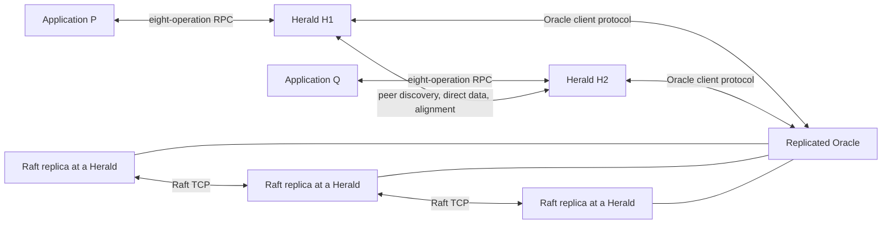

# Networked ECLIPS specification

This specification describes the current finite-run networked prototype: independent
Herald processes, private application namespaces, direct peer publication and
alignment, and an Oracle replicated by Raft. Applications are non-malicious and
the deployment is benign and non-Byzantine.

The implementation includes prepared-child startup, connected bootstrap and
`newenv` environments, dynamic Herald admission and repeated retirement, native
Raft learners and joint consensus, failed-voter-host exclusion, atomic label
decisions, and checked joining bases. Profile names used in code and scripts
identify experimental scope, not negotiated API or protocol versions.

The key words **MUST**, **MUST NOT**, **SHOULD**, and **MAY** are normative.
**Deferred** marks a capability outside this contract; **Open** marks an unsettled
choice. A specified obligation is not a claim that the current source has passed
an aggregate release gate. The [verification guide](../verification/README.md)
explains the available checks and how to record their results.

The [architecture guide](../architecture/README.md) provides design rationale and
implementation detail. Normative behavior remains owned by the modules below.

## 1. Source precedence

For this implementation, conflicts are resolved in this order:

1. this specification;
2. the observable semantic intent of the [2010 paper](../eclips-20100525.md), where
   this specification is silent; and
3. code and tests as implementation evidence, not permission to change a contract.

The runtime is a composition of separately owned pure machines. It has no
whole-world simulator state, centralized queue scan, direct cross-machine state
copy, or atomic transition over several Heralds. Repeated transition, protocol and
state-access structure should use lawful typed abstractions where they make
invariants and ownership easier to see.

## 2. Fixed architectural commitments

The first implementation MUST satisfy all of the following:

- The application library exposes exactly the paper's eight operations:
  `newid`, `newenv`, `write`, `forward`, `read`, `local-take`, `wait`, and
  `label`.
- The application library exposes process-epoch-local private unique IDs and
  typed private process/object/nabla/delta handles, never global unique or
  controlled object IDs. The resident Herald owns one stable bidirectional
  private-to-global unique-ID map for each live process epoch and recursively
  translates every declared unique-ID field and process/zombie label arm at that
  boundary. `SortId` remains deliberately public and is not translated.
- An application communicates only with its chosen Herald over an application RPC
  protocol. A Herald MAY serve many application processes concurrently.
- Heralds exchange ordinary publications, acknowledgements, topology placement,
  and context snapshots directly with one another. Ordinary data MUST NOT pass
  through the Oracle or the Raft log.
- A publication is pushed directly to each Herald hosting a delta of the
  publication's sort that is active and graph-reachable in the accepting Herald's
  frozen routing view. Peer Heralds do not relay the publication further.

- Every prototype edge admits every sort. Within the ordinary controlled-object
  envelope, its checked edge-specific payload contains only source, destination,
  and preserving/weakening strength; a selective sort predicate or filter set is
  not representable in the first-profile domain or codecs.
- A joining Herald starts with a possibly incomplete list of seed addresses and
  obtains the immutable system bootstrap through restricted discovery. It becomes
  an ordinary participant only after Oracle admission and local installation of
  the certified successor base. After an ordinary peer handshake, each side sends
  the other its complete known-Herald contact set.
  Pure Discovery admits those hints and explicitly requests direct connections to
  learned contacts whose exact identity and epoch match active membership. The
  runtime never dials merely by inspecting an inbound DTO. This transitive
  exchange remains discovery only: neither an address nor a successful TCP
  connection grants semantic authority, and publications are still never relayed
  through an intermediate Herald.
- Controlled instantiation, update, obsolescence, and structural carriers are
  admitted and published directly by Heralds. The Oracle does not approve them or
  own their application lifecycle. A conceptual Oracle orders `label`, the
  process/zombie facts needed by label, evidence-based predefined disappearance and
  regular-definition retirement, and later safe-reclamation cuts.
- Structural progress initially uses one per-origin sequence and an advertised
  membership-generation-qualified version vector; accepted structural work
  receives a sequence only when its local prerequisites are applied. Retirement
  seals an old source through the union of survivor-retained structural work before
  the successor generation establishes its first topology cut. Only exact canonical
  topology cuts established by the ordinary all-member barrier or a certified
  admission successor recipe may support historical-readiness certificates. A compact
  Oracle-ordered structural activation index is a documented fallback, not part of
  the initial profile.
- The Oracle is one deterministic replicated state machine. Registered active
  Heralds host its Raft replicas; committed stable or joint configurations
  determine the current nonempty voter sets. Raft membership and Herald
  membership are separate.
- Herald membership starts from the checked genesis set and advances through
  Oracle-committed admissions and retirements. Admission requires the
  complete old-member cut and matching old-member/newcomer readiness. Repeated
  retirements may extend an unfinished structural-base closure; admission waits
  for an established current base. A retired or cancelled epoch never returns,
  although its logical Herald identity may later receive a fresh admitted epoch.
  Explicit voter-role changes use registered learners and native joint consensus.
  Demotion preserves ordinary Herald service. Automatic failed-voter-host
  retirement retains fresh evidence from a strict majority of the full captured
  old voter configuration, including the failed target in the denominator.
  Native exclusion completes before semantic retirement. Loss of the required
  quorum permits no local voter-set shrink. Every Herald obtains fresh native
  quorum health and self-fences application authority after sustained isolation;
  cohosted Raft duties and operator status/drain retain their separate lifetimes.
- `label` uses both Raft ordering and a data-plane visibility barrier. A Raft
  quorum is never evidence that all required publications have become visible.
- TCP is the only required transport. Protocol framing, identity, validation,
  acknowledgement, and retry remain application-level responsibilities.
- Each application client, Herald, Oracle state machine, and Raft engine has a
  concrete pure deterministic transition kernel surrounded by a capability-based
  runtime shell.
  The kernels return explicit effect data; they do not call sockets, clocks,
  entropy, persistence, STM, or an effects library.
- A multithreaded shell uses STM-backed queues and small runtime-only
  coordination facts. Exactly one supervised task owns and advances each kernel
  state; STM is not another semantic state owner.
- Property tests and representative deterministic race schedules are part of
  every implementation slice.

## 3. Prototype assumptions

Profile 0.1 is an internal prototype between the deterministic PoC and a production
system. It is not published or supported for external consumers. Every protocol
endpoint in one run MUST be built against the same current API/schema definitions,
and every Herald, Oracle replica, and Raft voter MUST use the same deployment
catalogue. The profile label describes scope only; it never appears as an API or
protocol version.

Each build has exactly one application-facing API shape and one current serializer
for each protocol plane. Frames, handshakes, and DTOs carry no API/protocol
schema-version identifier, supported-version set, or compatibility range. There is
no negotiation, compatibility decoder, migration adapter, deprecation period,
rolling upgrade, or mixed-build operation.
During development an API, descriptor grammar, message union, or encoding may
change incompatibly at any time. Such a change replaces the sole definition and
its tests in lockstep; all roles are rebuilt, the incompatible experimental run is
discarded, and a fresh `SystemId`/genesis is started. Canonical hashes and catalogue
digests remain semantic/domain identifiers, while protocol-family magic is only a
fixed plane/role discriminator; none is a version-negotiation mechanism.

The prototype targets a deliberately small but real distributed system:

- all applications, Heralds, and Oracle replicas follow the protocol;
- no actor is Byzantine and no application attempts to forge private IDs, handles,
  or protocol messages; process-local ID isolation remains a semantic namespace
  rule, but profile 0.1 does not claim that its local counter values are
  cryptographically unguessable;
- TCP links may connect late, disconnect, reconnect, delay data, combine frames,
  and cause application-level retries;
- one live process may have several TCP connections over time, but a connection is
  not a process identity or proof of process death. Exact resume is available only
  during its configured absolute recovery grace; expiry of the last unexpectedly
  detached recovery-capable session may seal an ordered process-End intention;
- Herald and Raft state may initially be in memory. A Herald restart cannot resume
  its old epoch or sessions. The surviving system may permanently retire an
  unreachable Herald after qualified recovery/probe evidence and any required
  native voter exclusion. A lost epoch cannot resume after state loss; a fresh
  epoch may join through checked admission;
- a Raft majority is required for new Oracle decisions;
- every Herald captured by a `label` barrier is required until it applies the
  outcome or an Oracle retirement changes membership. The canonical label
  decision is immutable; retirement removes impossible installation requirements
  without changing an applied outcome;
- Byzantine protection, authentication, TLS, federation, abandoned-branch merge,
  transparent crash recovery, and complete bounded-history reclamation are deferred;
- individual semantic values, protocol DTOs, frames, runtime buffers/queues, and
  retained collections are assumed to fit the friendly finite run. The prototype
  defines no semantic resource quota, capacity accounting, reservation,
  saturation state, or capacity-exceeded rejection; and
- monotone counters, sequences, positions, revisions, terms, and indices are
  unsigned 64-bit quantities and are assumed never to overflow during a run.
  Overflow and wrap-around are outside profile 0.1: no ordinary successor,
  recovery, wrapping, saturation, rollover, capacity result, defensive branch, or
  overflow test is specified. This convention applies only to internal monotone
  state; it does not constrain the width or representation of an identifier
  generated from that state.

These limitations constrain availability and resource use, not the ordinary
networking shape. Heralds and applications are separate operating-system
processes, peer data traverses real TCP connections, and the Oracle is replicated
over a distinct Raft protocol.

If a process cannot allocate the memory or another host resource needed to continue
the experiment, that process and therefore the experimental run fail outside
ECLIPS semantics. It is not reported as `SessionSaturated`, `ResourceExhausted`, or
another application result. A production profile that promises bounded resource
use needs redesigned admission control, retained-state reclamation, durability, and
recovery rules; those concerns cannot be added to profile 0.1 merely by introducing
a capacity error.

Current executables default to a 768MiB GHC heap limit. The
[build resource policy](../../BUILDING.md)
also sets compiler budgets and guards process and aggregate RSS on macOS.
Reaching these limits fails the experimental run outside ECLIPS semantics.

Runtime verification follows the same profile boundary. It checks single-owner
serialization, whole-batch handoff, fair ingress, current/stale generation
filtering, ordinary callback and lane failure, retry/outcome correlation, orderly
drain, and typed replay with focused properties and representative composed
schedules. It does not claim hostile capability isolation, exhaustive
instruction-point cancellation, every theoretical teardown-fault permutation,
restart availability, or equal total order for causally independent events. A
production profile must specify those guarantees before tests for them become
acceptance gates.

## 4. Specification modules

The specification is divided by responsibility:

| Document | Normative subject |
| --- | --- |
| [01-semantics.md](01-semantics.md) | Observable data-space behavior and the exact eight-operation API. |
| [02-boundaries.md](02-boundaries.md) | State ownership, implementation modules, dependency rules, and pure transition boundaries. |
| [03-protocols.md](03-protocols.md) | Application RPC, peer discovery, direct publication, alignment, visibility, and TCP framing. |
| [04-oracle-and-raft.md](04-oracle-and-raft.md) | Narrow Oracle state and commands, label/process decisions, deferred safe reclamation, the topology-index fallback, and Raft replication. |
| [05-verification.md](05-verification.md) | Required properties, integration tests, evidence rules, and review obligations. |

Normative facts have one owning document. Other documents link to rather than
redefine them. A review diary, migration ledger, or implementation progress log
MUST live outside this directory.

## 5. System overview

The box labelled "Replicated Oracle" is a logical service, not a process that owns
all state. Each replica applies the same committed Oracle commands. The Herald role
and Raft-replica role may share an executable, but communicate through the same
typed boundary as separately hosted roles.

## 6. Terms and identity domains

| Term | Meaning |
| --- | --- |
| system | One ECLIPS lineage with one predefined catalogue and one Oracle history. |
| Herald | A trusted process that serves applications, owns local stores, and communicates with peers. |
| application process | A logical ECLIPS process epoch using one Herald; distinct from a TCP connection. |
| Oracle | The deterministic state machine that orders label/process facts and explicit global workflows; it does not approve ordinary controlled publication. |
| Raft replica | A registered native voter or learner replicating an opaque log; committed Oracle configurations project voter bindings without changing Herald membership. |
| sort | A type, key, validity predicate, obsolescence predicate, winner rank, and policy. |
| nabla | A typed graph vertex at which an application writes. |
| delta | A typed graph vertex with a Herald-hosted local store. |
| active entity | A nabla or delta whose controlled definition is current, labelled to a live process, and normally possessed by that process. |
| graph-reachable | Reachable through the ECLIPS directed graph; every prototype edge admits every sort. This is unrelated to whether a TCP socket is presently connected. |
| publication | One immutable, identified accepted write or forward with a frozen destination cut. |
| private unique ID | A positive process-epoch-local application token returned by `newid` or materialized when a global unique ID crosses the application boundary. Its global meaning is opaque and it is never reused within that process epoch. |
| global unique ID | An opaque internal 256-bit value carried in stored values, peer traffic, and, only when named by a genuine label/process/evidence workflow, Oracle commands. Runtime `newid`, `newenv`, and dynamic Start identities are produced by one Herald's independently seeded generator; `newenv` does not send its generated manifest to the Oracle. Selected genesis identities are trusted deployment assignments validated pairwise/disjoint. Neither form exposes generator or counter fields. |
| visible | Available to `read` and able to induce a predefined entity. Receiving or decoding bytes alone is not visibility. |
| control index | Position in the first-seen applied Oracle transition stream; duplicate Raft envelopes do not consume one. |
| store incarnation | One physical lifetime of an active delta store at one Herald. |

Identifiers from different domains MUST use distinct types. At minimum the design
distinguishes `SystemId`, `HeraldId`, `HeraldEpoch`, `ProcessId`,
`ProcessEpochId`, `ApplicationSessionId`, `ConnectionId`, `RequestId`,
`PrivateUniqueId`, `PrivateProcessId`, `PrivateObjectId`, `PrivateNablaId`,
`PrivateDeltaId`, `GlobalUniqueId`, `SortId`, `SortDefinitionOccurrenceId`,
`GlobalObjectId`, `NablaId`, `DeltaId`,
`StoreIncarnationId`, `PublicationId`, `StructuralSequence`,
`StructuralVersionVector`, `DecisionId`, `ControlIndex`, `RaftNodeId`,
`RaftTerm`, and `RaftLogIndex`.

## 7. Explicit decisions and refinements

This target records choices that must remain explicit. Some preserve paper
semantics that the PoC accidentally changed; others refine distributed details the
paper leaves open:

- `sort-sort` remains regular exactly because sort identity is the cryptographic
  hash of the canonical descriptor. Independent processes may publish the same
  definition and thereby name the same sort without allocating or sharing a
  controlled ID. The other topology-definition carriers remain controlled. The
  publication carrying that descriptor is still typed by the immutable primordial
  `sort-sort` occurrence; retirement epochs the regular sort **defined by** its
  payload, not that outer carrier. Conversely, primordial Nabla/Delta carriers
  merely **reference** a stable regular `SortId`, so their retained control
  prerequisite must meet the current Registry reference floor before that
  reference is bound to an occurrence.
- A sort supplies a pure total application rank. Stable publication identity is
  the final tie-break. The paper's mixture of a partial order and same-nabla order
  can form a cycle and is not used.
- Routing uses the accepting Herald's frozen local graph and placement cut. A later
  edge neither recalls an accepted publication nor adds a destination to it.
- Edge traversal is universal in the prototype. Nabla and delta typing still selects
  the source and eligible destination stores, and preserving/weakening strength is
  unchanged. This deliberately narrows the paper's optional edge predicate and
  leaves its type-restricted confinement construction unavailable in the benign
  first profile. Adding selective edges would be an intentional breaking change to
  the semantic type, primordial catalogue, and affected codecs, deployed in
  lockstep for a fresh run; it is not a compatible extension.
- `local-take` removes only visible state. Hidden retained winner and suppression
  metadata remains available for duplicate rejection and complete alignment.
- Historical alignment readiness is internal protocol state, not a ninth
  application operation.
- Every Herald retains local controlled object-to-sort, lifecycle, label
  observation, winner, and obsolete/deleted suppression state. First publication,
  current update, and obsolescence remain off the control log. Profile 0.1 keeps
  suppression for the finite run; a later Oracle workflow may coordinate safe
  reclamation only after bounded-latency and all-member readiness evidence.
- Structural occurrences are direct publications. Heralds advertise applied
  version vectors and accept canonical vector+digest cuts before using context
  readiness. Stream completion proves finite local reconciliation, not recursively
  completed alignment. If this model cannot be verified with acceptable
  complexity, the approved fallback orders only compact structural activation
  digests in the Oracle; no dormant fallback command exists in the initial build.
- The paper's two-level unique-ID model is retained. Every process epoch has one
  Herald-private, stable bijection between `PrivateUniqueId` and
  `GlobalUniqueId`; all of that epoch's sessions share it. Both `newid` forms
  return private IDs, and recursive value/query/result translation plus explicit
  process/zombie-label translation is the only application boundary by which
  global IDs become local or local IDs become global. The profile never rebinds
  an existing private ID, because system merge and global renaming require a
  separate production design.
- `newenv` creates an application-private graph environment within the same system.
  Its root controllers are locally generated/directly published and stabilized as
  structural data; it creates no Oracle object record, sort-definition object, or
  private `SortId`. Other applications receive no names or graph path into it.
- The prototype uses `HeraldEpoch` directly as process residence and has no distinct
  predefined host carrier. Physical-host modelling is deferred.

## 8. Deferred capabilities

The first implementation does not attempt:

- production security, hostile-client isolation, authentication, authorization at
  the TCP boundary, or encryption;
- a stable or publicly supported application API, wire protocol, or serialized
  representation;
- API/protocol version numbers, negotiation, compatibility decoding, rolling
  upgrades, mixed-build operation, or migration of an old experimental run;
- DDS compatibility or a general publish/subscribe API;
- networking the existing aggregate simulator;
- a shared central data store or Oracle-routed publication path;
- sort-selective edge predicates or filter sets;
- clever incremental graph algorithms;
- durable checkpoint storage and restart from state lost by an old epoch;
- durable Herald recovery, exactly-once transport, or exactly-once RPC;
- production resource accounting and admission control, retained-state
  bounds on all retained history, or resource-exhaustion recovery;
- independent-system federation or split-brain reconciliation;
- production-grade timing guarantees, old-epoch restart, or recovery/merge of an
  abandoned branch;
- reclaiming all hidden history or controlled-object metadata; or
- preserving the current implementation's module names, serialized forms, traces,
  or internal command vocabulary.

These are deliberate exclusions, not extension points that may leak into the
prototype merely to generalize an internal abstraction.
