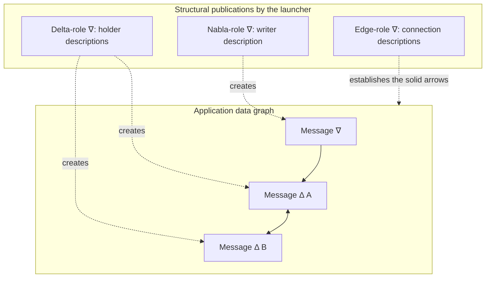
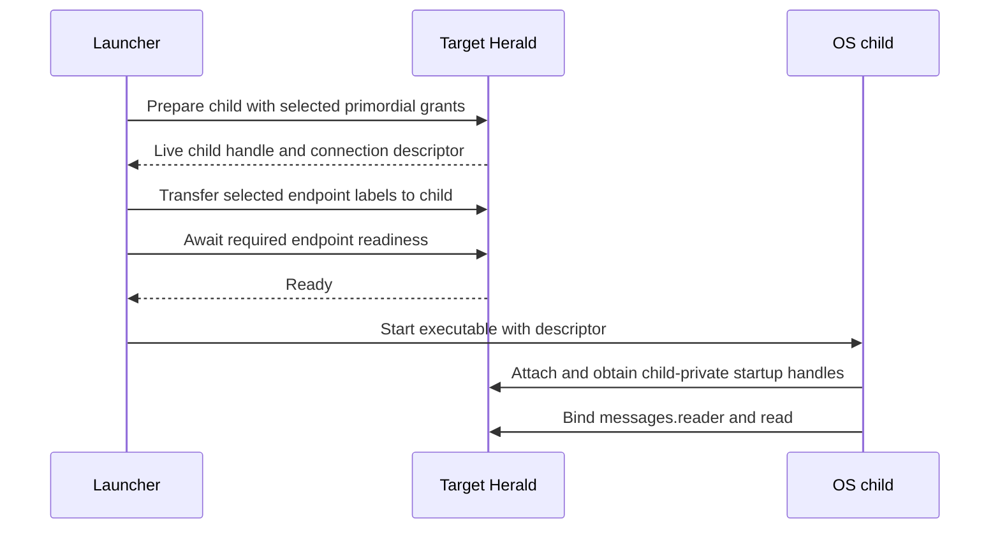
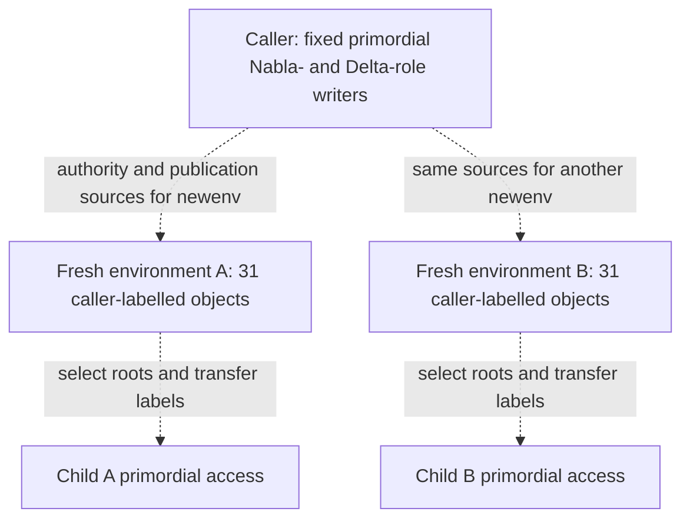
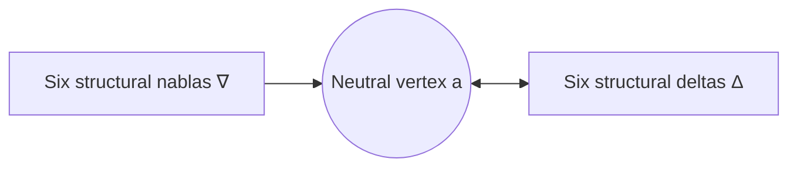
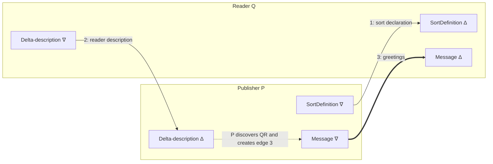

# Building a topology

The [introductory README](../README.md) shows how to run ECLIPS and exchange a
greeting. This guide explains how the endpoints and connections come into
existence: what an application receives at startup, what `newenv` creates, and
how separate applications acquire enough knowledge to connect their graphs.

There are two useful arrangements. A launcher can build the complete graph and
give each child the endpoints it needs, as [hello-context](../examples/hello-context/README.md)
does. Or it can give children structural endpoints so that they can build and
connect their own graphs. Both use ordinary application operations.

The Haskell fragments use `Eclips.Application.Typed` for ordinary topology and
payloads, and the lower-level `Eclips.Application` for manipulating selected
structural roots. They show successful setup paths; the runnable launchers also
retain preparation requests for cancellation, supervise OS processes, and end
their logical processes. `expect` below reports any failed result as an exception.

```haskell
{-# LANGUAGE DataKinds, DeriveGeneric, OverloadedStrings, TypeApplications #-}

import Control.Concurrent (threadDelay)
import Control.Monad (forM_, unless, void)
import Data.List (find)
import Data.Map.Strict qualified as Map
import Data.Set qualified as Set
import Data.Text (Text)
import Eclips.Application qualified as Raw
import Eclips.Application.Typed qualified as App
import Eclips.Application.Types.Access qualified as Access
import Eclips.Application.Types.Identity
import Eclips.Application.Types.Label (ApplicationLabelTarget (LabelToProcess), LabelResult (LabelApplied))
import Eclips.Application.Types.Lifecycle (HeraldLocator, PreparedChild, preparedChildProcess)
import Eclips.Application.Types.NewId (NewIdTarget (ControlledNewId))
import Eclips.Application.Types.Value (ApplicationLabelOwner (ProcessLabel), ApplicationValue (..))
import Eclips.Application.Types.Write (ApplicationWriteValue (PublishValue), WriteResult (WriteAccepted))
import GHC.Generics (Generic)

expect :: Show problem => Either problem value -> IO value
expect = either (ioError . userError . show) pure

data Message = Message {message :: Text}
  deriving (Eq, Show, Generic)

instance App.ValueType Message
instance App.ApplicationSort Message where
  sortPolicy = App.regularPolicy [App.key (App.field @"message")]
```

## What a process starts with

A **primordial set** is the application's named startup interface. It can contain
writers, readers, other controlled objects, process handles, or identity-only
names. It can be a whole environment, a mixture of objects from several
environments, or just one endpoint. Names such as `"messages.reader"` are chosen
by the application; they are not entries in a system-wide directory.

The parent selects objects using its own private handles. Preparation gives the
child its own handles for those same objects. Passing the parent's numeric private
IDs to an OS child would not do this. The child instead receives an opaque
connection descriptor and obtains its startup access when it attaches to its
Herald. `App.bindDelta @Message herald "messages.reader"`, for example, checks
the selected endpoint's role and carried sort and returns the child's typed handle.

An **environment** contains twelve endpoints, a neutral hub and eighteen
preserving edges. There is one writer and one reader for each of six predefined
sorts. The role describes the values that the pair carries, not the role of every
object mentioned in those values:

| Structural pair | Values carried | Typical application use |
| --- | --- | --- |
| SortDefinition | Sort descriptions | `declareSort`, `sortVisible` |
| NeutralVertex | Neutral graph vertices | `createVertex` |
| Edge | Directed edges | `createEdge` |
| Nabla | Writer endpoint descriptions | `createNabla`, `discoverNablas` |
| Delta | Reader endpoint descriptions | `createDelta`, `discoverDeltas` |
| ProcessEpoch | Process descriptions | Observe process objects; starting and ending processes uses lifecycle calls. |

For example, the **Delta-role writer** is a nabla that publishes descriptions of
deltas. A **message delta** stores `Message` values. Keeping these two levels
distinct makes the setup much easier to follow.

The first launcher receives a complete environment from checked system bootstrap,
with each structural writer connected to its hub and each reader connected to
the hub in both directions.
`App.startupEnvironment herald` retrieves that conventional complete bundle; it
does not allocate anything. It cannot retrieve a complete environment from the
one-endpoint startup used by a hello-context child.

## Build the application graph first

The hello-context launcher can use its startup environment to declare the greeting
sort, create a writer and context deltas, and connect them. This fragment shows
two holders; the executable constructs a cycle for the supplied holder list:

```haskell
buildContext :: App.Herald -> IO (App.Environment, App.Nabla Message, App.Delta Message, App.Delta Message)
buildContext herald = do
  environment <- expect (App.startupEnvironment herald)
  messageSort <- expect (App.compileSort @Message)
  App.declareSort environment messageSort >>= expect
  writer <- App.createNabla environment messageSort Nothing >>= expect
  holderA <- App.createDelta environment messageSort >>= expect
  holderB <- App.createDelta environment messageSort >>= expect
  let edge from to = void (App.createEdge environment App.Preserve from to >>= expect)
  edge (App.nablaVertex writer) (App.deltaVertex holderA)
  edge (App.deltaVertex holderA) (App.deltaVertex holderB)
  edge (App.deltaVertex holderB) (App.deltaVertex holderA)
  pure (environment, writer, holderA, holderB)
```

`createNabla`, `createDelta`, and `createEdge` reserve identities and publish the
corresponding structural descriptions through the environment's writers. The
Heralds apply those descriptions to their topology. The application does not edit
a Herald's graph directly. `Nothing` here selects an unsequenced message writer;
`Preserve` keeps normal data and possession normal along these paths.



Dashed arrows explain construction. Solid arrows are actual ECLIPS edges. The
structural writer that creates a delta is not automatically a source of that
delta's message data.

## Give a child an endpoint it can operate

Creation initially labels the endpoints to the launcher. A holder needs both a
startup grant for its delta and the delta's label transferred to its live logical
process. Here is the successful path for one freshly created holder delta:

```haskell
prepareHolder :: App.Herald -> HeraldLocator -> App.Delta Message -> IO PreparedChild
prepareHolder herald target reader = do
  selection <- expect (Access.primordialSelection
    [("messages.reader", Access.Reader (App.deltaId reader))]
    (Set.singleton "messages.reader")
    Nothing)
  child <- App.prepareChild herald target selection >>= expect
  let parent = Access.startupAccessProcess (App.startup herald)
  changed <- App.labelVertex (App.deltaVertex reader)
    (ProcessLabel parent, 0)
    (LabelToProcess (preparedChildProcess child)) >>= expect
  unless (changed == LabelApplied) (fail "holder label transfer did not apply")
  App.awaitChildReady herald child >>= expect
  pure child
```

The selection's second argument marks the reader as **required**: it must be
operational before initial attachment succeeds. The final `Nothing` supplies no
sources for `newenv`; this holder only needs to read its greeting. The expected
label `(ProcessLabel parent, 0)` is appropriate here because this is a fresh
endpoint with no previous label changes. For an existing object, use its observed
owner and generation and check the result of the comparison.



Preparation creates the logical process before the OS program is started. This
gives the parent a process handle to use as the label target. Granting possession
alone does not make a parent-labelled endpoint operational for the child, and a
required-endpoint declaration adds no authority. The descriptor comes from
`preparedChildConnection child`; it is the value passed to the executable, not
the parent's endpoint handles. The target Herald must already belong to the
running system.

The full [launcher](../examples/hello-context/applications/ContextLauncher.hs)
uses the advanced lifecycle interface to retain the preparation reference before
waiting, so a failure can cancel that exact preparation. It then starts the child
and supervises its lifetime. Repeat the same arrangement for the publisher's
writer and the other holders. The launcher retains its edge labels and stays
alive; the holder processes keep their deltas active.

After the publisher has written and exited, the launcher creates a **new** delta,
adds a preserving edge from an existing holder to it, and prepares a reader with
that delta. The greeting arrives by context alignment. Startup grants and label
transfers do not copy another process's delta store.

## Give a child an environment of its own

`App.newEnvironment herald` is the typed form of `newenv`. It creates a fresh
connected bundle of six structural pairs, a hub, and eighteen edges in the same
running system. All 31 objects are initially labelled to the caller. It does not
create a process, replace the caller's startup access, or change the sources used
by its later `newenv` calls.

The authority for this operation comes from **two designated startup writers**:
one carrying Nabla descriptions and one carrying Delta descriptions. They must
still be operational when `newenv` is called. A partial primordial set containing
those two writers can support `newenv`; a child given only a greeting endpoint
cannot. The designation is explicit in the selection's `environmentSources`.



These dashed arrows are setup actions, not data-space edges. The operation first
creates the twelve endpoints through the two startup writers. After an installed
topology cut establishes their publication authority, it uses the fresh
NeutralVertex-role and Edge-role writers to create the hub and wiring. It returns
only after the complete environment is established and its descriptions are
readable in its own structural readers. It creates no application-visible bridge
back to its source environment.

`App.environmentSelection` converts a full environment into conventional startup
names for all 31 objects, marks all twelve endpoints required, and designates its
Nabla-role and Delta-role writers as the child's future `newenv` sources. A
launcher can add application endpoints from elsewhere:

```haskell
withEndpoints :: App.Environment -> [(Text, Access.PrimordialEntry)] -> IO Access.PrimordialSelection
withEndpoints environment extra =
  expect (Access.primordialSelection entries required (Access.selectionEnvironmentSources base))
  where
    base = App.environmentSelection environment
    entries = Map.toList (Access.selectionEntries base) <> extra
    required = Access.selectionRequiredEndpoints base <> Set.fromList (map fst extra)

publisherSelection :: App.Herald -> App.Nabla Message -> IO Access.PrimordialSelection
publisherSelection herald messages = do
  environment <- App.newEnvironment herald >>= expect
  withEndpoints environment [("messages.writer", Access.Writer (App.nablaId messages))]
```

The [API-tour launcher](../examples/hello-world/applications/HelloLauncher.hs)
uses this arrangement. It creates separate publisher and reader environments,
creates the greeting/acknowledgement/command graph through its own startup
environment, and combines the appropriate message endpoints with each child's
fresh structural bundle. It prepares both children, transfers the labels of
**all** the selected objects, and awaits readiness before starting them.

It does not connect those fresh environments to each other or rely on discovery
between them. The application graph is already connected and its endpoints are
explicit startup grants. A fresh environment supplies the child with construction
tools; it need not be the origin of every other endpoint in that child's startup.

For these selections of fresh, distinct controlled objects, the label step
can iterate over all selected entries. This is the multi-endpoint version of
`prepareHolder`:

```haskell
prepareEndpoints :: App.Herald -> HeraldLocator -> Access.PrimordialSelection -> IO PreparedChild
prepareEndpoints herald target selection = do
  child <- App.prepareChild herald target selection >>= expect
  let parent = Access.startupAccessProcess (App.startup herald)
  forM_ (Map.elems (Access.selectionEntries selection)) $ \entry -> do
    changed <- Raw.label herald
      (asPrivateObjectId (Access.primordialEntryIdentity entry))
      (ProcessLabel parent, 0)
      (LabelToProcess (preparedChildProcess child)) >>= expect
    unless (changed == LabelApplied) (fail "endpoint label transfer did not apply")
  App.awaitChildReady herald child >>= expect
  pure child
```

This helper assumes every entry is a newly created controlled object to be handed
over; arbitrary primordial selections can also contain passive or identity-only
entries that should not undergo this transfer.

Label handoff creates new reader-store incarnations; it does not copy their old
contents. If the child needs the environment's retained descriptions, keep a live
copy of each structural sort outside the readers being transferred. One option is
to connect its hub to a parent-owned structural context in both directions and
wait for the descriptions to arrive there before moving the readers. Ordinary
alignment can then populate the child's new stores. Such bridges deliberately
share structural context; universal edges do not provide sort-filter isolation.

## The connected environment from the paper

The [paper's `newenv` description](eclips-20100525.md#92-newenv) refers to an
environment like its bootstrap environment. [Figure 3](eclips-20100525.pdf#page=15)
shows the structural endpoints connected through a neutral vertex. Both bootstrap
and `newenv` supply that connected form directly.



The bundled symbols stand for six separate writers and six separate readers.
Each writer has an edge to `a`; `a` has an edge to each reader, and each reader has
an edge back to `a`. These are preserving edges. Endpoint sorts select which
values each reader stores. The return edges put the readers in a common SCC and
make their retained descriptions available as context through `a`. The paper
notes that these return edges are optional for the basic publication path, but
useful for accessing retained information through the common vertex.

The handles are part of the returned environment:

```haskell
connectedEnvironment :: App.Herald -> IO (App.Environment, App.Vertex)
connectedEnvironment herald = do
  environment <- App.newEnvironment herald >>= expect
  pure (environment, App.environmentHub environment)
```

`App.environmentEdges environment` returns the eighteen ordinary edges in
canonical role order, with writer-to-hub, hub-to-reader and reader-to-hub for each
role. `App.environmentSelection` includes both the hub and these edges as object
grants. Transfer their labels along with the endpoint labels if the child should
control the whole environment.

The descriptions of this environment's 31 objects and the six shared sort
definitions are its initial context. Later connections use ordinary context
alignment; creating an unrelated reader does not automatically populate it with
every environment's descriptions.

The bootstrap objects are labelled to the founder process. A process identity
remains meaningful after End: its labels become zombie labels with the same
generation. The hub and edges remain effective while their descriptions survive
in application stores; their label owner need not stay alive. Active endpoints
still require live owners. An application that wants the topology to survive the
founder must arrange live stores and transfer the endpoints it will use.

The hub remains separate from any application-message hub or context cycle that
an application might build. All edges admit every sort, so connecting such hubs
also connects their reachable structural data: endpoint typing still determines
which readers store which values, but an edge is not a per-sort access filter.

## Let applications discover and connect to each other

For applications that should create their own message endpoints, the launcher can
instead wire structural channels before handing over the environments. Consider a
publisher P and a reader Q, each with a fresh environment. Both executables know
the Haskell `Message` type. The parent installs two preserving connections:

1. P's SortDefinition writer to Q's SortDefinition reader, so Q can observe the
   sort P declares.
2. Q's Delta-description writer to P's Delta-description reader, so P can discover
   the message delta Q creates.



All solid arrows are ordinary ECLIPS edges. The endpoint sorts explain the values
they deliver; edges themselves have no sort filter. The dashed arrow describes
P's application code acting on a discovery result.

The current typed facade exposes application vertices via `nablaVertex` and
`deltaVertex`, but does not wrap arbitrary structural-root IDs as `Vertex` values.
For this initial wiring, use the lower-level structural publication interface.
The following helper selects checked environment roots and publishes a preserving
edge with the same fields used by `createEdge`:

```haskell
rootPair :: App.Environment -> Access.ApplicationPredefinedSortRole -> Access.PredefinedAccess
rootPair environment role =
  case find ((== role) . Access.predefinedAccessRole)
       (Access.environmentAccessPredefined (App.environmentAccess environment)) of
    Just pair -> pair
    Nothing -> error "a checked environment contains every predefined role"

connectRoots :: App.Herald -> App.Environment -> PrivateUniqueId -> PrivateUniqueId -> IO ()
connectRoots herald builder source destination = do
  let writer = Access.predefinedWriter (rootPair builder Access.EdgeRole)
      parent = Access.startupAccessProcess (App.startup herald)
  identifier <- Raw.newid herald (ControlledNewId writer) >>= expect
  result <- Raw.write herald writer (PublishValue (RecordValue (Map.fromList
    [ ("object_id", UniqueIdValue identifier)
    , ("label", LabelValue (ProcessLabel parent, 0))
    , ("source_vertex", UniqueIdValue source)
    , ("destination_vertex", UniqueIdValue destination)
    , ("strength", EnumValue "preserve")
    ]))) >>= expect
  unless (result == WriteAccepted) (fail "structural edge publication did not apply")

wireDiscovery :: App.Herald -> App.Environment -> App.Environment -> App.Environment -> IO ()
wireDiscovery herald builder pEnvironment qEnvironment = do
  let connect role from to = connectRoots herald builder
        (privateNablaUniqueId (Access.predefinedWriter (rootPair from role)))
        (privateDeltaUniqueId (Access.predefinedReader (rootPair to role)))
  connect Access.SortDefinitionRole pEnvironment qEnvironment
  connect Access.DeltaRole qEnvironment pEnvironment
```

Call this in the parent's session, while it possesses the roots of both fresh
environments. `builder` can be the parent's startup environment. Then prepare P
with `App.environmentSelection pEnvironment` and Q with
`App.environmentSelection qEnvironment`, using `prepareEndpoints` to transfer the
31 selected object labels to each child and await readiness before launch. The
parent retains control of the bridge edges during this workflow. The two bridges
are directed; neither gives both applications unrestricted readback of both
environments. Each environment already has local structural readback through
its hub.

After attachment, Q waits to observe the declared sort, then publishes its reader
description. P waits for that description and uses the resulting private handle
to create the application edge. Here are the setup portions of those child
programs; the caller keeps each session open for the subsequent message workflow:

```haskell
setupReader :: App.Herald -> IO (App.Delta Message)
setupReader herald = do
  environment <- expect (App.startupEnvironment herald)
  messageSort <- expect (App.compileSort @Message)
  let awaitSort = do
        visible <- App.sortVisible environment messageSort >>= expect
        unless visible (threadDelay 10_000 >> awaitSort)
  awaitSort
  App.createDelta environment messageSort >>= expect

setupPublisher :: App.Herald -> IO (App.Nabla Message)
setupPublisher herald = do
  environment <- expect (App.startupEnvironment herald)
  messageSort <- expect (App.compileSort @Message)
  App.declareSort environment messageSort >>= expect
  writer <- App.createNabla environment messageSort Nothing >>= expect
  let awaitReader = do
        readers <- App.discoverDeltas environment messageSort >>= expect
        case readers of
          [] -> threadDelay 10_000 >> awaitReader
          [reader] -> pure reader
          _ -> fail "this example expects exactly one advertised message reader"
  reader <- awaitReader
  App.createEdge environment App.Preserve (App.nablaVertex writer) (App.deltaVertex reader) >>= expect
  pure writer
```

`discoverDeltas` reads **descriptions** from P's structural reader. Preserving
delivery gives P normal possession of Q's delta object and a private name with
which to refer to it in an edge. Q still owns the delta's label and operates its
store; P cannot use that handle to read Q's store. The resulting greeting edge
connects P's message writer directly to Q's message reader, even when their
processes reside on different Heralds. The Heralds arrange the TCP delivery.

The polling loops observe semantic conditions rather than assuming setup finished
after a fixed delay. Publication success is acceptance, not an acknowledgement
that a remote application has observed the value. Accepted publications can still
arrive after the publisher ends. Observe the greeting at Q before declaring the
demo successful or stopping Q; its delta is the only greeting store in this
graph. This arrangement supplies no replicated context for a future reader after
Q ends, unlike hello-context's surviving holder cycle.

If a description was published before its discovery path existed, an application
that possesses the controlled object can `forward` it through the matching
structural writer to advertise it again. A delta description uses the Delta-role
writer; an edge description uses the Edge-role writer. Forwarding preserves the
object's identity and label and is not required after every edge creation. Sort
definitions are regular values, so advertise those again with `declareSort`.

## Keep the three kinds of connection distinct

An environment groups structural endpoints; it is not a network connection or an
automatically connected graph. A primordial selection grants particular objects
at process startup; it is not a copy of a parent's stores. An ECLIPS edge creates
a data-space path; its endpoint labels determine the active operators, and their
Heralds handle physical delivery.

The working sources illustrate different parts of the story:

- [ContextLauncher](../examples/hello-context/applications/ContextLauncher.hs)
  builds a context graph centrally and gives each child one message endpoint.
- [HelloLauncher](../examples/hello-world/applications/HelloLauncher.hs) combines
  fresh environments with explicitly supplied application endpoints and handles
  complete child preparation, label transfer, and OS supervision.
- [HelloApplication](../examples/hello-world/HelloApplication.hs) shows sort
  visibility and endpoint-discovery calls in the singleton API tour; its startup
  wiring is already provided, unlike the two fresh environments above.
- The [semantic specification](networked/01-semantics.md#53-newenv) defines
  `newenv`, and the [startup contract](architecture/application-startup.md) details
  selections, source writers, preparation, and readiness.
