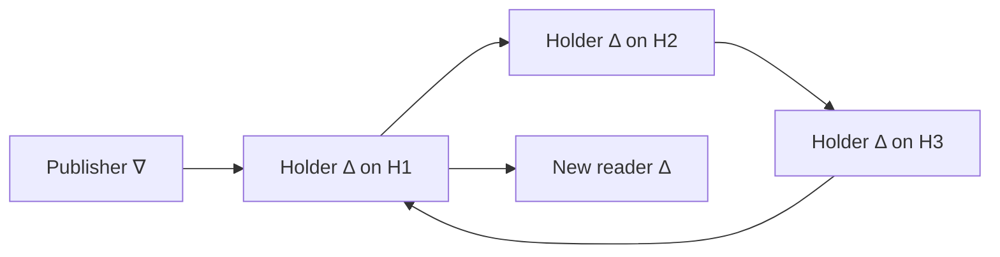

# Hello from context

This example publishes `Hello, world!`, lets the publisher exit, and only then
creates a reader. The reader gets the greeting from its **context**: existing
delta stores connected upstream of its new delta. You can create more readers
without restarting the publisher.

The longer experiment places the context on three Heralds and gives each Herald
an Oracle vote. After one Herald crashes, a fresh reader still obtains the
greeting. Its creation and label transfer also demonstrate that the surviving
Oracle can complete new work.

The existing [application API tour](../hello-world/README.md) remains available
under its original package and executable names. It exercises a broader set of
operations, including acknowledgements and local take.

## What stays alive

The launcher prepares independent OS processes for three small roles:

- A **publisher** writes once, explicitly ends its logical process, and exits.
- Each **context holder** owns a greeting delta and stays alive until you quit.
- A **reader** is created on request, reads from a new delta, prints the greeting,
  ends its logical process, and exits.

The launcher connects the holder deltas with preserving edges in a cycle. Every
holder can reach every other holder, so they form one strongly connected component
(SCC). With one holder the cycle is a self-edge. Each new reader is connected
downstream of that component:



These are semantic graph edges; Heralds deliver publications directly to the
Heralds hosting the destination stores. The publisher's exit ends its own
lifetime, while the holders keep the greeting available. The launcher owns the
edges and must remain alive during the experiment.

When a holder's Herald is retired, its delta becomes passive. That vertex still
routes through the launcher-owned edges, leaving the surviving holders connected.
The greeting remains in their stores and can supply a new reader's context.
All of this state is in memory; the example does not save the greeting to disk.

## Build once

Follow the [root build instructions](../../README.md#building), including the
project-local Cabal configuration and compiler notes. Run every command below
from the repository root. Finish the build before starting the example; use the
built executables directly so several live terminals do not start concurrent
Cabal builds.

The application executable finds itself when starting its publisher, readers,
and holders. You do not need to install separate child executables.

## First run: one Herald, two terminals

In terminal 1, resolve the Herald executable and start a fresh system:

```sh
HERALD=$(cabal --config-file="$PWD/.cabal/config" list-bin eclips-deployment:exe:eclips-herald)
"$HERALD" --bootstrap --bind 127.0.0.1 --base-port 7100 \
  --launcher-output .cabal/hello-context.connection
```

The output includes a fresh `system` identity, application endpoint
`127.0.0.1:7101`, administration endpoint `127.0.0.1:7102`, and a final `ready`
line. Wait for `ready` before continuing. The founder starts a Herald and the
initial Oracle voter, and writes the launcher connection descriptor.

In terminal 2, run:

```sh
HELLO=$(cabal --config-file="$PWD/.cabal/config" list-bin eclips-hello-context:exe:eclips-hello-context)
"$HELLO" --connection-file .cabal/hello-context.connection \
  --context-herald 127.0.0.1:7101 --once
```

Expect these lines in this order:

```text
publisher exited
context stored greeting on 127.0.0.1:7101
context ready; publisher exited
Hello, world!
reader completed
context stopped
```

The publisher has already ended and its OS process has exited when
`publisher exited` appears. The holder's observation then establishes that it has
the greeting. Only afterwards does the launcher create the reader's delta and
connect it to the existing context. That reader could not have received the
original live publication.

The example ends its application processes and returns to your shell. Stop the
Herald with Ctrl-C in terminal 1.

For an interactive singleton run, start a fresh Herald with the same command and
run the example without `--once`. At its command prompt, try:

```text
read 127.0.0.1:7101
read 127.0.0.1:7101
quit
```

Each `read` creates a separate reader with a new delta. `quit` stops the context
holders and ends the launcher. Stop the Herald after the example has exited.

A launcher descriptor belongs to one logical process and cannot be reused after
that process ends. Begin each new experiment with a fresh founder, which writes
a fresh connection file. There is no need to remove or recreate the build.

## Three voters and a crash

Use a fresh run for this experiment. Stop the singleton Herald first so ports
7100–7104 are available. You will use two terminals again: terminal 1 operates
three background Heralds; terminal 2 runs the interactive example. Keep both
terminals open until cleanup.

### Start the Heralds

In terminal 1:

```sh
HERALD=$(cabal --config-file="$PWD/.cabal/config" list-bin eclips-deployment:exe:eclips-herald)
ADMIN=$(cabal --config-file="$PWD/.cabal/config" list-bin eclips-deployment:exe:eclips-admin)
mkdir -p .cabal/hello-context

"$HERALD" --bootstrap --bind 127.0.0.1 --base-port 7100 \
  --launcher-output .cabal/hello-context/launcher.connection \
  > .cabal/hello-context/herald-1.log 2>&1 &
H1_PID=$!
tail -f .cabal/hello-context/herald-1.log
```

Wait for `ready`, then press Ctrl-C to stop **the log viewer**. The background
Herald stays running. Capture the system identity from its labelled output:

```sh
HELLO_SYSTEM=$(awk '$1 == "system" { print $2; exit }' .cabal/hello-context/herald-1.log)
```

Join H2 through H1's peer port:

```sh
"$HERALD" --bind 127.0.0.1 --base-port 7200 --peer 127.0.0.1:7100 \
  > .cabal/hello-context/herald-2.log 2>&1 &
H2_PID=$!
tail -f .cabal/hello-context/herald-2.log
```

Again, wait for `ready`, then Ctrl-C the log viewer. Join H3 through H2:

```sh
"$HERALD" --bind 127.0.0.1 --base-port 7300 --peer 127.0.0.1:7200 \
  > .cabal/hello-context/herald-3.log 2>&1 &
H3_PID=$!
tail -f .cabal/hello-context/herald-3.log
```

Wait for `ready`, then Ctrl-C the log viewer. The three processes now share one
system. The base ports give each Herald five endpoints:

| Herald | Peer | Application | Administration | Oracle | Raft |
| --- | --- | --- | --- | --- | --- |
| H1 | 7100 | 7101 | 7102 | 7103 | 7104 |
| H2 | 7200 | 7201 | 7202 | 7203 | 7204 |
| H3 | 7300 | 7301 | 7302 | 7303 | 7304 |

All endpoints in this tutorial bind to `127.0.0.1`. The default takeover target is
five seconds; failure detection and configuration changes still require progress
by the surviving majority. The [deployment guide](../../deployment/README.md)
describes other endpoint and timing choices.

### Give the newcomers Oracle votes

Joining makes a Herald an active application host, initially without an Oracle
vote. Prepare the local replica on **all three** hosts. Preparing the founder also
publishes its concrete replica contacts:

```sh
"$ADMIN" --endpoint 127.0.0.1:7102 --system "$HELLO_SYSTEM" prepare-oracle
"$ADMIN" --endpoint 127.0.0.1:7202 --system "$HELLO_SYSTEM" prepare-oracle
"$ADMIN" --endpoint 127.0.0.1:7302 --system "$HELLO_SYSTEM" prepare-oracle
```

Each command should report `receipt-result OracleAccepted`. H1 is already a
voter; H2 and H3 register as learners. Their receipts contain lines of this form
(the symbolic IDs below stand for the actual hex strings printed in your run):

```text
receipt-voter-result Registered NODE_2_HEX host=HOST_2_HEX
receipt-voter-result Registered NODE_3_HEX host=HOST_3_HEX
```

Keep H2's and H3's **node** IDs, which follow `Registered`, rather than the host
IDs following `host=`. Inspect H1's applied configuration:

```sh
"$ADMIN" --endpoint 127.0.0.1:7102 --system "$HELLO_SYSTEM" oracle-configuration
```

Wait until it lists all three `replica` registrations. Initially there is one
entry on the `voters` line and `pending-change none`. Copy its `configuration-id`
and the two learner node IDs into these variables, replacing the quoted text:

```sh
HELLO_CONFIGURATION='paste the configuration-id here'
HELLO_NODE_2='paste H2 node ID here'
HELLO_NODE_3='paste H3 node ID here'

"$ADMIN" --endpoint 127.0.0.1:7102 --system "$HELLO_SYSTEM" \
  commission-voters "$HELLO_CONFIGURATION" "$HELLO_NODE_2" "$HELLO_NODE_3"
```

The command adds H2 and H3 to the existing H1 voter. Its accepted receipt means
the change has started. Inspect each host to see when it has completed:

```sh
"$ADMIN" --endpoint 127.0.0.1:7102 --system "$HELLO_SYSTEM" oracle-configuration
"$ADMIN" --endpoint 127.0.0.1:7202 --system "$HELLO_SYSTEM" oracle-configuration
"$ADMIN" --endpoint 127.0.0.1:7302 --system "$HELLO_SYSTEM" oracle-configuration
```

Repeat these queries until all three report the same `configuration-id`, a
`voters` line with **three** `NODE@HOST` entries, and `pending-change none`.
`old-voters` and `new-voters` lines indicate the intermediate joint configuration;
let that transition finish. Do not repeat `commission-voters` to wait for it.

### Publish and retain the greeting

In terminal 2, still from the repository root:

```sh
HELLO=$(cabal --config-file="$PWD/.cabal/config" list-bin eclips-hello-context:exe:eclips-hello-context)
"$HELLO" --connection-file .cabal/hello-context/launcher.connection \
  --context-herald 127.0.0.1:7101 \
  --context-herald 127.0.0.1:7201 \
  --context-herald 127.0.0.1:7301
```

Wait for:

```text
publisher exited
context stored greeting on 127.0.0.1:7101
context stored greeting on 127.0.0.1:7201
context stored greeting on 127.0.0.1:7301
context ready; publisher exited
commands: read HOST:PORT | quit
```

This is the checkpoint for the crash. Every holder has read the greeting from
its own store, the publisher is gone, and no greeting reader has yet been created.
Successful `write` alone would not establish these remote observations.

### Crash H3 and inspect the survivors

In terminal 1, terminate the exact background process whose PID you captured:

```sh
kill -KILL "$H3_PID"
wait "$H3_PID" || true
```

This deliberately skips semantic drain. Keep H1, H2, and the launcher running.
The two surviving voters form a majority of the original three. They can commit
H3's exclusion from the Oracle configuration and then retire its Herald.

Inspect the surviving hosts:

```sh
"$ADMIN" --endpoint 127.0.0.1:7102 --system "$HELLO_SYSTEM" oracle-configuration
"$ADMIN" --endpoint 127.0.0.1:7202 --system "$HELLO_SYSTEM" oracle-configuration
"$ADMIN" --endpoint 127.0.0.1:7102 --system "$HELLO_SYSTEM" status
"$ADMIN" --endpoint 127.0.0.1:7202 --system "$HELLO_SYSTEM" status
```

Repeat until both configurations agree on a new `configuration-id`, the `voters`
line contains **two** entries, and `pending-change none` appears. The status
snapshots should then show `phase AdminServingDto` and two `active-heralds`.
Historical `replica` registrations can remain in the configuration output; count
current `voters`, not all registered replicas. A leader hint alone does not prove
that the Oracle can complete work.

Now, in terminal 2, type:

```text
read 127.0.0.1:7201
```

Expect:

```text
Hello, world!
reader completed
```

This is a new process and a new reader delta created after the crash. Preparing
that process and transferring its delta's label require Oracle-backed work.
Receiving the greeting then demonstrates that the surviving context supplies
previously published data. You can repeat the command or read on H1:

```text
read 127.0.0.1:7101
```

The remaining two-voter configuration requires both voters. Killing another
Herald would lose the majority needed for Oracle progress; a minority cannot
remove the other voter to declare itself healthy. This experiment demonstrates
one crash, with two live hosts retaining both coordination and context.

### Finish the experiment

In terminal 2:

```text
quit
```

Wait for `context stopped` and the shell prompt. In terminal 1, stop and reap the
two surviving Herald processes:

```sh
kill -TERM "$H1_PID" "$H2_PID"
wait "$H1_PID" || true
wait "$H2_PID" || true
```

The logs remain under `.cabal/hello-context/` for inspection. To repeat the
experiment, start fresh Heralds and use their new launcher descriptor and system
identity. Restarting a stopped process does not restore its previous volatile
state.

## Reading the code

The [topology guide](../../docs/topology.md) walks through the launcher's structural
publications, primordial selections, and label transfers with diagrams. It also
explains the general case with `newenv` and discovery between environments. This
example keeps the setup smaller: the launcher uses its startup environment and
each child receives just one message endpoint.

[`ContextApplication.hs`](applications/ContextApplication.hs) contains the small
publisher, reader, and holder workflows. The publisher calls `write` and
`endProcess` without waiting for a reader acknowledgement. The reader and holders
loop over `wait` and `read`, checking for the greeting after every wake. The
selected endpoints are bound as `Nabla Message` and `Delta Message` after checking
their immutable carried sort against the complete sort derived from `Message`.

[`ContextLauncher.hs`](applications/ContextLauncher.hs) creates the sort and graph,
prepares children, transfers endpoint labels, and starts the executable's child
roles with their own opaque connection descriptors. It waits for publisher exit
and every holder's observation before offering interactive reads.

[`ContextVocabulary.hs`](applications/ContextVocabulary.hs) defines a Haskell
`Message` record, its key policy, a typed field predicate, and the preserving
cycle. Generic derivation supplies its schema and codec. The launcher uses
`declareSort`, `createNabla`, `createDelta`, and `createEdge` to construct the
graph. Context follows from that graph; there is no message persistence flag.
[`ContextArguments.hs`](applications/ContextArguments.hs) handles connection
arguments and Herald application locators. All four modules use the application
API and types, without imports from Herald or Oracle kernels.

## Focused checks

From the repository root, after stopping the manual experiment:

```sh
cabal --config-file="$PWD/.cabal/config" test -j4 \
  eclips-hello-context:test:hello-context-properties \
  eclips-hello-context:test:hello-context-integration \
  --test-show-details=direct
```

The property suite checks reachability and endpoints of generated holder cycles.
The process suite checks that a singleton reader starts after publisher exit, and
that a fresh reader obtains context after one of three voting Heralds stops. It
uses the same public deployment and administration interfaces as this walkthrough.
The existing API-tour tests remain separate and unchanged.
